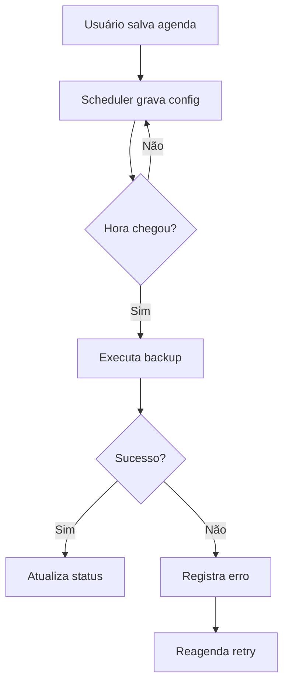

# 📦 PRD - Backup Automatizado com Agendamento do Usuário

## Visão Geral
Criar um recurso de backup automatizado para preservar os dados do MyTimeTrace VS Code com agendamento definido pelo usuário. O foco é reduzir risco de perda de dados, dar controle de horário e manter o fluxo simples dentro da extensão.

## Problema
Hoje, o usuário depende de rotinas manuais para proteger os dados locais. Isso aumenta risco de perda por falha do sistema, troca de máquina, corrupção do banco ou erro humano.

## Objetivos
- Garantir backup recorrente dos dados críticos.
- Permitir que o usuário defina frequência e horário.
- Reduzir impacto no uso normal da extensão.
- Dar visibilidade clara do último backup, próximo backup e falhas.

## Não Objetivos
- Sincronia em tempo real.
- Backup em nuvem como requisito inicial.
- Restauração automática sem ação do usuário.
- Versionamento avançado de histórico no MVP.

## Público-Alvo
- Usuários que usam a extensão em rotina diária.
- Pessoas que dependem dos dados de rastreio para relatório ou cobrança.
- Times que querem evitar perda de base local.

## Escopo Do MVP
### Funcionalidades
- Agendar backup por dia, hora e intervalo.
- Permitir escolha de frequência: diário, semanal ou custom.
- Permitir ajuste de horário pelo usuário.
- Executar backup em segundo plano.
- Guardar log do último backup e do próximo agendado.
- Exibir alerta só em falha ou ação pedida.

### Tipos De Backup
- Banco SQLite local.
- Configs do usuário ligadas ao backup.
- Metadados úteis para resta.

## Requisitos Funcionais
### RF01 - Configurar agendamento
O usuário deve poder definir quando o backup roda e em qual ritmo.

### RF02 - Executar backup
A extensão deve gerar cópia segura dos dados sem travar a UI.

### RF03 - Ajustar agenda
O usuário deve poder trocar hora, dias e fuso local a qualquer momento.

### RF04 - Ver status
A UI deve mostrar status do último backup, do próximo e de erros.

### RF05 - Retentar falha
Se o backup falhar, o sistema deve tentar de novo em janela curta e registrar o erro.

## Requisitos Não Funcionais
- Não bloquear o uso da extensão.
- Ter baixo custo de CPU e disco.
- Ter logs claros para debug.
- Ser seguro contra sobrescrita sem aviso.
- Ser compatível com Windows, macOS e Linux.

## UX / UI
### Entradas Do Usuário
- Frequência: diário, semanal, custom.
- Hora de execução.
- Dias da semana, se houver agenda semanal.
- Pasta de destino do backup.

### Saídas Na UI
- Badge ou card com estado: ativo, pausado, falha.
- Data e hora do último backup.
- Data e hora do próximo backup.
- Botão de backup manual.
- Botão de restaurar, se o módulo existir no escopo final.

## Regras De Produto
- Backup não deve rodar com a UI travada.
- O agendamento deve respeitar o fuso local do usuário.
- O usuário pode pausar e retomar o backup.
- Se a pasta alvo sumir, a extensão deve avisar e parar o ciclo.
- Em falha, preservar o backup anterior.

## Fluxo Esperado

## Premissas Técnicas
- O módulo pode reaproveitar a base de persistência atual.
- O agendador deve rodar de forma assíncrona.
- O backup deve ser incremental se viável, mas o MVP pode usar cópia plena.
- O sistema precisa guardar estado do agendador entre reinícios.

## Dependências Prováveis
- Módulo de banco local.
- Config de usuário.
- Serviço de agendamento.
- Logs e status bar.

## Métricas De Sucesso
- % de backups concluídos com êxito.
- Tempo médio por backup.
- Nº de falhas por semana.
- Nº de usuários que usam agenda ativa.
- Nº de backups manuais vs auto.

## Critérios De Aceite
- O usuário consegue definir um horário e ver ele salvo.
- O backup roda sem travar a extensão.
- O status muda após cada execução.
- Falhas geram log e aviso útil.
- O backup manual funciona como plano B.

## Riscos
- Arquivo em uso no momento da cópia.
- Erro de permissão na pasta alvo.
- Agenda perdida após restart.
- Diferença de fuso entre sistema e config.
- Crescimento alto do volume de backup.

## Fases Sugeridas
### Fase 1
- Agendamento básico.
- Backup manual.
- Status simples.

### Fase 2
- Retry.
- Pausa e retomada.
- Melhor log.

### Fase 3
- Política de retenção.
- Compressão.
- Exportação extra.

## Perguntas Em Aberto
- O backup será só local ou também em nuvem?
- O usuário pode definir mais de um horário por dia?
- Qual política de retenção deve valer no MVP?
- Restauração entra já na primeira versão?
