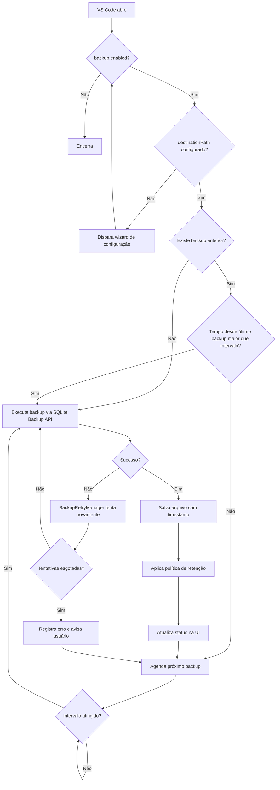

# PRD - Backup Automatizado com Agendamento do Usuário

## Visão Geral

Criar um recurso de backup automatizado para preservar os dados do MyTimeTrace VS Code com agendamento definido pelo usuário. O foco é reduzir risco de perda de dados, dar controle total de horário e local, e manter o fluxo simples dentro da extensão.

## Problema

Hoje, o usuário depende de rotinas manuais para proteger os dados locais. Isso aumenta risco de perda por falha do sistema, troca de máquina, corrupção do banco ou erro humano.

## Objetivos

- Garantir backup recorrente dos dados críticos.
- Permitir que o usuário defina frequência, horário e local de destino.
- Reduzir impacto no uso normal da extensão.
- Dar visibilidade clara do último backup, próximo backup e falhas.

## Não Objetivos

- Backup em nuvem como requisito. A extensão é open source: usuários podem optar por não usar a plataforma em nuvem e precisam de uma alternativa local confiável.
- Sincronização em tempo real.
- Restauração automática do banco sem ação explícita do usuário. O sistema nunca substitui os dados atuais por um backup sem que o usuário solicite.
- Versionamento avançado de histórico no MVP.

## Público-Alvo

- Usuários que usam a extensão em rotina diária.
- Pessoas que dependem dos dados de rastreio para relatório ou cobrança.
- Times que querem evitar perda de base local.
- Usuários open source que não utilizam a plataforma em nuvem.

## Contexto: Backup Local vs Sync em Nuvem

O projeto já possui sincronização de dados com a plataforma em nuvem (`SyncManager`). O backup local e o sync são **sistemas completamente separados e independentes**: possuem schedulers distintos, configurações distintas e não interferem um no outro em nenhuma circunstância.

| | Sync em Nuvem | Backup Local |
|---|---|---|
| **Protege contra** | Perda no dispositivo único | Corrupção do banco, falha de rede, troca de máquina |
| **Configurado por** | Servidor (dinâmico) | VS Code settings (local, pelo usuário) |
| **Requer conta** | Sim | Não |
| **Destino** | Plataforma MyTimeTrace | Pasta local definida pelo usuário |
| **Scheduler** | `SyncManager` (horários do servidor) | `BackupManager` (intervalo local) |

## Escopo Do MVP

### Funcionalidades

- Agendar backup por intervalo livre: a cada hora, a cada 4 horas, etc.
- Permitir que o usuário defina o número máximo de backups retidos (ex: 2 a 100).
- Permitir que o usuário defina a pasta de destino.
- Executar backup em segundo plano usando SQLite Backup API.
- Guardar log do último backup e do próximo agendado.
- Exibir alerta só em falha ou ação pedida.
- Backup só roda com o VS Code aberto (sem daemon externo).

### Arquivo de Backup

- **Fonte**: arquivo `time_tracker.sqlite` (banco único da extensão).
- **Destino**: pasta definida pelo usuário nas configurações.
- **Nomenclatura**: `time_tracker_YYYY-MM-DD_HH-mm-ss.sqlite`
- **Organização**: cada backup é um arquivo individual na pasta de destino.
- **Retenção**: o usuário define quantos backups manter. Ao atingir o limite, o backup mais antigo é removido automaticamente.

### Localização do Banco de Dados Original

O arquivo `time_tracker.sqlite` fica em uma pasta gerenciada automaticamente pelo VS Code. O usuário não precisa saber o caminho para usar o backup — a extensão localiza o arquivo sozinha. A tabela abaixo serve apenas como referência para quem quiser inspecionar o arquivo manualmente.

**VS Code**

| Sistema | Caminho completo |
|---|---|
| Windows | `C:\Users\SeuNome\AppData\Roaming\Code\User\globalStorage\BelicioBCardoso.my-time-trace-vscode\time_tracker.sqlite` |
| macOS | `~/Library/Application Support/Code/User/globalStorage/BelicioBCardoso.my-time-trace-vscode/time_tracker.sqlite` |
| Linux | `~/.config/Code/User/globalStorage/BelicioBCardoso.my-time-trace-vscode/time_tracker.sqlite` |

**Outros editores baseados no VS Code** (Cursor, VS Code Insiders, Windsurf)

A estrutura é idêntica. Apenas o nome da pasta do aplicativo muda:

| Editor | Pasta do aplicativo |
|---|---|
| VS Code Insiders | `Code - Insiders` |
| Cursor | `Cursor` |
| Windsurf | `Windsurf` |

Exemplo no macOS com Cursor: `~/Library/Application Support/Cursor/User/globalStorage/BelicioBCardoso.my-time-trace-vscode/time_tracker.sqlite`

## Requisitos Funcionais

### RF01 - Configurar agendamento

O usuário deve poder definir o intervalo de execução do backup nas configurações do VS Code (local settings). Exemplos: a cada 1 hora, a cada 4 horas, a cada 24 horas. O agendamento é independente do sync com o servidor — os dois sistemas não se comunicam e não se interferem.

### RF02 - Executar backup

A extensão deve copiar o arquivo `time_tracker.sqlite` usando a **SQLite Backup API** (`VACUUM INTO` ou equivalente via `sqlite3_backup_*`), garantindo integridade mesmo com o banco em uso. O backup não pode travar a UI.

### RF03 - Ajustar configuração

O usuário deve poder alterar a qualquer momento:
- Intervalo de execução.
- Número máximo de backups retidos.
- Pasta de destino.

Todas as configurações ficam em `settings.json` (VS Code local settings).

### RF04 - Ver status

A UI deve mostrar:
- Data e hora do último backup concluído.
- Data e hora do próximo backup agendado.
- Estado atual: ativo, pausado ou falha.
- Erros com mensagem útil.

### RF05 - Retentar falha

Se o backup falhar, o sistema deve tentar novamente em janela curta, seguindo o padrão do `SyncRetryManager` existente. Um `BackupRetryManager` será criado com a mesma arquitetura — mesmos métodos `execute()`, `updateConfig()` e `notifyFailure()` — porém com valores **fixos por padrão**, sem dependência de servidor:

- `maxRetries`: 3 tentativas
- `retryDelayMs`: 30.000ms (30 segundos)

Diferente do `SyncRetryManager` (que recebe configuração dinâmica do backend via `/sync/config`), o `BackupRetryManager` usa esses defaults constantes. O erro é registrado em log e exibido ao usuário após falha total nas 3 tentativas.

### RF06 - Política de retenção

Ao concluir um backup com sucesso:
1. Listar todos os backups existentes na pasta de destino.
2. Se o número de arquivos exceder o limite configurado, remover o(s) mais antigo(s).
3. Registrar remoção em log.

O número mínimo de backups retidos é **3**. A extensão não permite configurar um valor menor para garantir que sempre haja pelo menos uma cópia de segurança anterior disponível.

### RF07 - Backup manual

O usuário deve poder acionar um backup imediato via comando da extensão, independente do agendamento. O comando **`MyTimeTrace: Fazer Backup Agora`** fica sempre disponível na paleta de comandos do VS Code, mesmo com o backup automático pausado.

### RF08 - Configuração inicial guiada (wizard)

Na primeira vez que o backup é ativado, ou quando nenhuma configuração estiver definida, a extensão conduz o usuário por um wizard passo a passo:

1. **Pasta de destino** — abre o file picker nativo do VS Code para o usuário escolher ou criar a pasta onde os backups serão salvos.
2. **Intervalo de execução** — exibe um Quick Pick com opções predefinidas: `1h`, `4h`, `8h`, `12h`, `24h` e `Personalizado`. Se escolher personalizado, um Input Box solicita o valor em horas. O intervalo é salvo no `settings.json` e será usado pelo agendamento automático a partir da Fase 2.
3. **Retenção máxima** — Input Box para o usuário informar quantos backups manter (mínimo 3, padrão 10).
4. **Resumo e confirmação** — exibe as escolhas feitas e pergunta se deseja ativar o backup agora. Ao confirmar, a configuração é salva no `settings.json` e o primeiro backup é executado imediatamente.

O wizard também pode ser acessado a qualquer momento pelo comando `MyTimeTrace: Configurar Backup`, permitindo reconfiguração completa.

## Requisitos Não Funcionais

- Não bloquear o uso da extensão.
- Usar SQLite Backup API para garantir cópia segura com banco aberto.
- Backup só executa com o VS Code aberto (sem daemon externo).
- Ter baixo custo de CPU e disco.
- Ter logs claros para debug.
- Ser seguro contra sobrescrita sem aviso.
- Ser compatível com Windows, macOS e Linux (usar `path.join()` para caminhos).

## UX / UI

### Configurações do Usuário (VS Code Settings)

```json
{
  "myTimeTraceVSCode.backup.enabled": true,
  "myTimeTraceVSCode.backup.intervalHours": 4,
  "myTimeTraceVSCode.backup.maxBackups": 10,
  "myTimeTraceVSCode.backup.destinationPath": "",
  "myTimeTraceVSCode.backup.github.enabled": false,
  "myTimeTraceVSCode.backup.github.repository": ""
}
```

- `enabled`: ativa ou pausa o backup automático.
- `intervalHours`: intervalo entre backups em horas (mínimo: 1).
- `maxBackups`: número máximo de backups retidos na pasta (mínimo: 3, padrão: 10).
- `destinationPath`: caminho absoluto da pasta onde os backups serão salvos. **Recomendado usar o wizard** (`MyTimeTrace: Configurar Backup`) para definir esse valor, pois ele abre o seletor de pasta do sistema e evita erros de digitação. Se preenchido manualmente, use o caminho completo conforme o seu sistema operacional:

  | Sistema | Exemplo de caminho válido |
  |---|---|
  | Windows | `C:\Users\SeuNome\Documents\MyTimeTrace\Backups` |
  | macOS | `/Users/SeuNome/Documents/MyTimeTrace/Backups` |
  | Linux | `/home/SeuNome/documentos/mytimetrace/backups` |

  **Orientações para leigos:**
  - Crie uma pasta dedicada para os backups. Não use a área de trabalho nem pastas de sistema (`C:\Windows`, `/usr`, `/etc`).
  - O caminho deve começar com a letra do disco no Windows (`C:\`) ou com `/` no macOS e Linux.
  - Use barras invertidas `\` no Windows e barras normais `/` no macOS e Linux.
  - A pasta precisa existir antes de salvar a configuração, ou a extensão tentará criá-la automaticamente.
  - Se a pasta estiver em um pendrive ou HD externo, o backup pausará automaticamente quando o dispositivo for desconectado.

- `github.enabled`: indica se o backup offsite no GitHub está ativo (Fase 4).
- `github.repository`: nome do repositório privado criado para os backups (Fase 4).

**Estado interno (não exposto no settings.json):**
- `github.notificationDismissed`: flag persistida via `context.globalState` (API nativa do VS Code para estado interno da extensão). É `true` quando o usuário clicou em "Não perguntar novamente". Não aparece no settings.json porque não é uma preferência do usuário — é estado interno da extensão.
- O token PAT do GitHub é armazenado no `context.secrets` (VS Code Secret Storage, mesmo mecanismo da API Key atual), nunca em texto plano.

### Saídas Na UI

- Badge ou card com estado: ativo, pausado, falha.
- Data e hora do último backup.
- Data e hora do próximo backup.
- Botão de backup manual.
- Botão de abrir pasta de destino.

### Comandos da Extensão

Todos os comandos ficam disponíveis na paleta de comandos do VS Code (`Ctrl+Shift+P`).

| Comando | Descrição | Fase |
|---|---|---|
| `MyTimeTrace: Fazer Backup Agora` | Executa um backup imediato, independente do agendamento | 1 |
| `MyTimeTrace: Pausar Backup Automático` | Pausa o agendamento automático (equivale a `backup.enabled = false`) | 2 |
| `MyTimeTrace: Retomar Backup Automático` | Retoma o agendamento pausado (equivale a `backup.enabled = true`) | 2 |
| `MyTimeTrace: Abrir Pasta de Backup` | Abre no explorador de arquivos do sistema a pasta de destino configurada | 1 |
| `MyTimeTrace: Configurar Backup no GitHub` | Inicia o fluxo assistido de configuração do backup offsite no GitHub | 4 |
| `MyTimeTrace: Editar Configurações de Backup` | Abre diretamente a seção de backup nas configurações do VS Code (`settings.json`) | 1 |
| `MyTimeTrace: Configurar Backup` | Inicia o wizard guiado de configuração inicial (pasta, intervalo, retenção). Pode ser usado também para reconfigurar | 1 |

## Regras De Produto

- Backup não deve rodar com a UI travada.
- O backup só executa enquanto o VS Code estiver aberto. Não há daemon externo.
- O backup é completamente independente do sync em nuvem: desativar o sync não afeta o backup, e vice-versa.
- Na inicialização, se o intervalo já tiver sido ultrapassado, o backup roda imediatamente antes de aguardar o próximo ciclo.
- O usuário pode pausar e retomar o backup via setting `backup.enabled`.
- Se a pasta de destino não existir ou não for acessível, a extensão avisa e pausa o ciclo.
- Em falha, preservar todos os backups anteriores.
- Ao atingir o limite de retenção, remover o mais antigo antes de criar o novo.
- O número mínimo de backups retidos é 3. A extensão não aceita valor menor.

## Lógica de Inicialização

Ao iniciar o VS Code, o `BackupManager` executa a seguinte verificação antes de qualquer agendamento:

```
1. backup.enabled = true?
   └── Não → encerra, não agenda nada

2. destinationPath configurado?
   └── Não → dispara wizard de configuração completo (RF08)
              → ao concluir o wizard, reinicia este fluxo do passo 1

3. Existe algum backup anterior na pasta de destino?
   ├── Não → executa backup imediatamente (primeiro backup)
   └── Sim → lê timestamp do último backup em sync_metadata
               ├── Timestamp ausente no sync_metadata?
               │   (ocorre em reinstalação, migração ou cópia manual de arquivos)
               │   └── trata como se último backup = nunca → executa backup imediatamente
               └── Timestamp presente → (agora - último backup) > intervalHours?
                   ├── Sim → executa backup imediatamente (backup perdido enquanto VS Code estava fechado)
                   └── Não → agenda próximo backup para (último backup + intervalHours)
```

Essa lógica garante que um backup nunca seja pulado silenciosamente: se o VS Code ficou fechado durante o horário em que o backup deveria ter rodado, ele é executado assim que o VS Code abre. Em caso de dúvida (timestamp ausente), a decisão segura é sempre executar o backup.

## Fluxo Esperado



## Premissas Técnicas

- O `BackupManager` e o `SyncManager` são módulos completamente independentes. Não compartilham scheduler, não se comunicam e não interferem um no outro.
- O `sync_metadata` (key-value store SQLite) será usado para persistir o timestamp do último backup e o estado do agendador entre reinícios.
- Na inicialização, o `BackupManager` verifica se o intervalo já foi ultrapassado e executa o backup imediatamente se necessário, evitando backups perdidos.
- O agendador usa `setInterval` nativo, sem dependência externa de cron.
- A cópia do banco usa **SQLite Backup API** (`VACUUM INTO 'destino.sqlite'` ou `sqlite3_backup_*`) para garantir integridade mesmo com o banco em uso.
- O `BackupRetryManager` seguirá a mesma arquitetura do `SyncRetryManager` existente.
- Configurações de backup ficam em VS Code local settings (`settings.json`), completamente independentes das configurações de sync vindas do servidor.
- O backup só roda com o VS Code aberto. Não há daemon ou processo externo.

## Dependências Prováveis

- `DatabaseManager` existente (acesso ao SQLite e ao `sync_metadata` para persistir timestamps de backup).
- VS Code settings API — `vscode.workspace.getConfiguration()` para leitura das preferências do usuário.
- VS Code `context.globalState` — para persistir estado interno como `github.notificationDismissed`, sem expor ao usuário no settings.json.
- VS Code `context.secrets` — para armazenar o token PAT do GitHub de forma segura (mesmo mecanismo da `ApiKeyManager` atual).
- `BackupRetryManager` (novo, baseado no `SyncRetryManager` existente).
- StatusBar e painéis de UI existentes (para exibir status do backup).

## Métricas De Sucesso

- % de backups concluídos com êxito.
- Tempo médio por backup.
- Número de falhas por semana.
- Número de usuários com backup ativo.
- Número de backups manuais vs automáticos.

## Critérios De Aceite

- O wizard conduz o usuário pelos 4 passos e ao confirmar o primeiro backup é executado imediatamente.
- O usuário consegue definir intervalo, limite de retenção e pasta de destino.
- O backup roda sem travar a extensão.
- O arquivo gerado tem nome no formato `time_tracker_YYYY-MM-DD_HH-mm-ss.sqlite` e é uma cópia válida do banco.
- O status atualiza após cada execução mostrando data/hora do último backup e do próximo.
- Falhas geram log e aviso útil.
- O backup manual funciona como alternativa ao agendamento, inclusive com backup automático pausado.
- Ao atingir o limite de retenção, o backup mais antigo é removido automaticamente (mínimo 3 mantidos).
- Cópia feita via SQLite Backup API é íntegra mesmo com banco em uso.
- Se o VS Code ficou fechado durante o horário do backup, o backup é executado imediatamente ao reabrir.

## Riscos

- Pasta de destino removida ou sem permissão durante o ciclo.
- Agenda perdida após restart (mitigado com `sync_metadata`).
- Diferença de fuso entre sistema e config (usar horário do sistema local).
- Crescimento alto do volume de backup (mitigado pela política de retenção).
- Arquivo `.sqlite` corrompido se copiado sem Backup API (mitigado pelo uso da API correta).
- Colisão de nome de arquivo: se um backup automático e um manual coincidirem no mesmo segundo, ambos gerariam o mesmo nome `time_tracker_YYYY-MM-DD_HH-mm-ss.sqlite`. Mitigação: adicionar sufixo incremental quando o arquivo já existir (`_1`, `_2`, etc.).

## Fases Sugeridas

### Fase 1

- Wizard de configuração inicial (pasta, intervalo, retenção).
- Backup manual via comando `MyTimeTrace: Fazer Backup Agora` usando SQLite Backup API.
- Status simples (último backup concluído).
- Retenção básica (apagar mais antigo ao atingir limite).
- Comandos: `Fazer Backup Agora`, `Abrir Pasta de Backup`, `Editar Configurações de Backup`, `Configurar Backup`.

> O intervalo é coletado no wizard nesta fase e salvo no `settings.json`, mas o agendamento automático só entra em operação na Fase 2.

### Fase 2

- Agendamento automático por intervalo via `setInterval` nativo.
- Verificação de backup perdido na inicialização do VS Code.
- `BackupRetryManager` com retry em falha (baseado no `SyncRetryManager`).
- Pausa e retomada via comandos `Pausar Backup Automático` e `Retomar Backup Automático`.
- Exibição do próximo backup agendado no status.
- Restauração de backup: o usuário seleciona um arquivo da pasta de destino e a extensão o aplica como banco ativo.
- Log detalhado de operações.

### Fase 3

- Compressão dos arquivos de backup (ex: `.sqlite.gz`).
- Exportação para outros formatos (CSV, JSON).
- Notificação de backup bem-sucedido (opcional, configurável).

### Fase 4

Backup offsite opcional no GitHub, totalmente automatizado após configuração inicial guiada pelo usuário.

#### Ativação (opt-in)

A extensão oferece a opção via notificação após cada backup local concluído com sucesso, enquanto o backup no GitHub não estiver configurado e o usuário não tiver marcado "Não perguntar novamente". A notificação apresenta duas ações: **"Configurar backup no GitHub"** e **"Não perguntar novamente"**.

- Se o usuário clicar em "Não perguntar novamente", a notificação nunca mais é exibida e a flag é persistida nas configurações locais.
- Independente da escolha, o comando **`MyTimeTrace: Configurar Backup no GitHub`** fica sempre disponível na paleta de comandos do VS Code. O usuário pode iniciar o fluxo de configuração a qualquer momento por ali.
- Nada acontece sem consentimento explícito.

#### Fluxo de configuração inicial (assistido)

Ao aceitar, a extensão conduz o usuário passo a passo:

1. **Token PAT** — a extensão explica o que é um Personal Access Token, aponta o link de geração nas configurações do GitHub e solicita o token. O escopo mínimo necessário é `repo` (acesso a repositórios privados).
2. **Nome do repositório** — o usuário informa o nome desejado. A extensão deixa claro que o repositório **precisa ser privado** e explica o risco de um repositório público conter dados de rastreamento pessoal.
3. **Criação do repositório** — a extensão cria o repositório privado via API do GitHub automaticamente, sem que o usuário precise acessar o site.
4. **Confirmação** — a extensão exibe um resumo da configuração e confirma que está pronta para operar.

Após a configuração, o usuário não precisa fazer mais nada.

#### Operação automática (pós-configuração)

- A cada backup local concluído com sucesso, a extensão faz commit e push do arquivo para o repositório privado automaticamente.
- A mensagem de commit segue o padrão: `backup: time_tracker_YYYY-MM-DD_HH-mm-ss.sqlite`.
- O token PAT fica armazenado no VS Code Secret Storage (mesmo mecanismo da API Key atual), nunca em texto plano.
- A política de retenção local continua valendo normalmente; o GitHub mantém o histórico completo via Git.
- Em caso de falha no push, o backup local já está seguro — o erro é registrado em log e avisado ao usuário, mas não cancela nem desfaz o backup local.

## Decisões Registradas

| Decisão | Definição |
|---|---|
| Intervalos por dia | Um único intervalo fixo em horas (ex: a cada 4h). Sem múltiplos horários configurados manualmente. |
| Restauração de backup | Entra na Fase 2. |
| Mínimo de retenção | 3 backups. A extensão não aceita valor menor. |
| Backup e sync | Sistemas completamente independentes. O sync do servidor não interfere no backup local em nenhuma hipótese. |
| Backup perdido | Se o VS Code ficou fechado durante o horário de backup, o backup roda imediatamente ao abrir o VS Code. |
