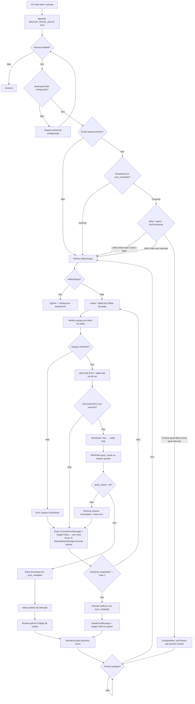

# PRD - Backup Automatizado com Agendamento do Usuário

## Visão Geral

Criar um recurso de backup automatizado para preservar os dados do MyTimeTrace VS Code com agendamento definido pelo usuário. O foco é reduzir risco de perda de dados, dar controle total de horário e local, e manter o fluxo simples dentro da extensão.

## Problema

Hoje, o usuário depende de rotinas manuais para proteger os dados locais. Isso aumenta risco de perda por falha do sistema, troca de máquina, corrupção do banco ou erro humano.

## Objetivos

- Garantir backup recorrente dos dados críticos.
- Permitir que o usuário defina frequência, horário e local de destino.
- Reduzir impacto no uso normal da extensão.
- Dar visibilidade clara do último backup, próximo backup e falhas.

## Não Objetivos

- Backup em nuvem como requisito. A extensão é open source: usuários podem optar por não usar a plataforma em nuvem e precisam de uma alternativa local confiável.
- Sincronização em tempo real.
- Restauração automática do banco sem ação explícita do usuário. O sistema nunca substitui os dados atuais por um backup sem que o usuário solicite.
- Versionamento avançado de histórico no MVP.

## Público-Alvo

- Usuários que usam a extensão em rotina diária.
- Pessoas que dependem dos dados de rastreio para relatório ou cobrança.
- Times que querem evitar perda de base local.
- Usuários open source que não utilizam a plataforma em nuvem.

## Contexto: Backup Local vs Sync em Nuvem

O projeto já possui sincronização de dados com a plataforma em nuvem (`SyncManager`). O backup local e o sync são **sistemas completamente separados e independentes**: possuem schedulers distintos, configurações distintas e não interferem um no outro em nenhuma circunstância.

| | Sync em Nuvem | Backup Local |
|---|---|---|
| **Protege contra** | Perda no dispositivo único | Corrupção do banco, falha de rede, troca de máquina |
| **Configurado por** | Servidor (dinâmico) | VS Code settings (local, pelo usuário) |
| **Requer conta** | Sim | Não |
| **Destino** | Plataforma MyTimeTrace | Pasta local definida pelo usuário |
| **Scheduler** | `SyncManager` (horários do servidor) | `BackupManager` (intervalo local) |

## Escopo Do MVP

### Funcionalidades

- Agendar backup por intervalo livre: a cada hora, a cada 4 horas, etc.
- Permitir que o usuário defina o número máximo de backups retidos (ex: 2 a 100).
- Permitir que o usuário defina a pasta de destino.
- Executar backup em segundo plano usando SQLite Backup API.
- Guardar log do último backup e do próximo agendado.
- Exibir alerta só em falha ou ação pedida.
- Backup só roda com o VS Code aberto (sem daemon externo).

### Arquivo de Backup

- **Fonte**: arquivo `time_tracker.sqlite` (banco único da extensão).
- **Destino**: pasta definida pelo usuário nas configurações.
- **Nomenclatura**: `time_tracker_YYYY-MM-DD_HH-mm-ss.sqlite`
- **Organização**: cada backup é um arquivo individual na pasta de destino.
- **Retenção**: o usuário define quantos backups manter. Ao atingir o limite, o backup mais antigo é removido automaticamente.

### Localização do Banco de Dados Original

O arquivo `time_tracker.sqlite` fica em uma pasta gerenciada automaticamente pelo VS Code. O usuário não precisa saber o caminho para usar o backup — a extensão localiza o arquivo sozinha. A tabela abaixo serve apenas como referência para quem quiser inspecionar o arquivo manualmente.

**VS Code**

| Sistema | Caminho completo |
|---|---|
| Windows | `C:\Users\SeuNome\AppData\Roaming\Code\User\globalStorage\BelicioBCardoso.my-time-trace-vscode\time_tracker.sqlite` |
| macOS | `~/Library/Application Support/Code/User/globalStorage/BelicioBCardoso.my-time-trace-vscode/time_tracker.sqlite` |
| Linux | `~/.config/Code/User/globalStorage/BelicioBCardoso.my-time-trace-vscode/time_tracker.sqlite` |

**Outros editores baseados no VS Code** (Cursor, VS Code Insiders, Windsurf)

A estrutura é idêntica. Apenas o nome da pasta do aplicativo muda:

| Editor | Pasta do aplicativo |
|---|---|
| VS Code Insiders | `Code - Insiders` |
| Cursor | `Cursor` |
| Windsurf | `Windsurf` |

Exemplo no macOS com Cursor: `~/Library/Application Support/Cursor/User/globalStorage/BelicioBCardoso.my-time-trace-vscode/time_tracker.sqlite`

## Requisitos Funcionais

### RF01 - Configurar agendamento

O usuário deve poder definir o intervalo de execução do backup nas configurações do VS Code (local settings). Exemplos: a cada 1 hora, a cada 4 horas, a cada 24 horas. O agendamento é independente do sync com o servidor — os dois sistemas não se comunicam e não se interferem.

### RF02 - Executar backup

A extensão deve copiar o arquivo `time_tracker.sqlite` usando o comando **`VACUUM INTO`** do SQLite, executado via `db.run()` do pacote npm `sqlite3` (já presente no projeto):

```typescript
// -2. Verificar integridade do banco de ORIGEM antes de qualquer operação.
//     Um VACUUM INTO executado sobre banco corrompido pode gerar backup corrompido que
//     passa no quick_check — propagando silenciosamente a corrupção para todos os backups.
//     Usar PRAGMA quick_check no banco ativo (db, não um arquivo novo).
//     Se falhar: notificar o usuário e ABORTAR — não criar backup de fonte inválida.
await new Promise<void>((resolve, reject) => {
  db.get('PRAGMA quick_check', (err, row: { quick_check: string }) => {
    if (err || row?.quick_check !== 'ok') {
      reject(new Error(
        'O banco de dados ativo está corrompido (PRAGMA quick_check falhou). ' +
        'O backup foi cancelado para evitar propagar a corrupção. ' +
        'Verifique o arquivo time_tracker.sqlite manualmente.'
      ));
    } else {
      resolve();
    }
  });
});
// -1. Limpar arquivos .tmp órfãos — de backups interrompidos por crash, kill ou poweroff.
//     Executado no início de cada performBackup() antes de qualquer outra operação.
//     Seguro deletar: *.sqlite.tmp nunca é backup válido, nunca está na lista de retenção.
//     ATENÇÃO: usar vscode.workspace.fs (não fs.promises) — ver Premissas Técnicas.
//     readDirectory() retorna [string, FileType][] — não string[] como readdir().
try {
  const destUri = vscode.Uri.file(path.dirname(destPath));
  const entries = await vscode.workspace.fs.readDirectory(destUri);
  const orphans = entries
    .filter(([name, type]) => type === vscode.FileType.File && name.endsWith('.sqlite.tmp'))
    .map(([name]) => name);
  for (const orphan of orphans) {
    await vscode.workspace.fs.delete(vscode.Uri.file(path.join(path.dirname(destPath), orphan)))
      .then(undefined, () => {}); // ignorar erro se já foi removido
    outputChannel.appendLine(`[BackupManager] Orphan .tmp removido: ${orphan}`);
  }
} catch { /* pasta pode não existir ainda — seguro ignorar */ }
// 0. Verificar espaço em disco disponível antes de iniciar
//    fs.promises.statfs é exceção intencional: não tem equivalente em vscode.workspace.fs.
//    Disponível a partir do Node.js v19 (Electron 28+).
//    Em versões anteriores, capturar SQLITE_FULL no callback e mapear para mensagem útil.
try {
  const volumeStats = await fs.promises.statfs(path.dirname(destPath));
  const availableBytes = volumeStats.bavail * volumeStats.bsize;
  const dbStat = await vscode.workspace.fs.stat(vscode.Uri.file(databaseManager.getDbPath()));
  const dbSize = dbStat.size;
  if (availableBytes < dbSize * 1.5) { // margem de 50% sobre o tamanho atual do banco
    throw new Error(
      `Espaço insuficiente em disco: ${Math.round(availableBytes / 1048576)}MB disponíveis, necessário ~${Math.round(dbSize * 1.5 / 1048576)}MB.`
    );
  }
} catch (e: any) {
  if (e.code === 'ERR_INVALID_ARG_TYPE') { /* statfs indisponível — prosseguir sem check */ }
  else throw e;
}
// 1. Validar path — aspas simples quebram o SQL (VACUUM INTO não aceita placeholder ?)
//    Adicionalmente: path deve ser absoluto e não conter null bytes.
if (destPath.includes("'")) {
  throw new Error("O caminho de destino não pode conter aspas simples ( ' ).");
}
if (!path.isAbsolute(destPath)) {
  throw new Error("O caminho de destino deve ser absoluto.");
}
if (destPath.includes('\0')) {
  throw new Error("O caminho de destino contém caracteres inválidos.");
}
// 2. Garantir que a pasta de destino existe (VACUUM INTO não cria pastas)
//    vscode.workspace.fs.createDirectory já é recursivo por padrão.
await vscode.workspace.fs.createDirectory(vscode.Uri.file(path.dirname(destPath)));
// 3. Resolver colisão de nome — VACUUM INTO falha se o arquivo já existir
//    (dois backups no mesmo segundo: manual + automático, ou múltiplas janelas do VS Code)
//    AVISO TOCTOU: o loop verifica existência e o VACUUM INTO escreve depois — há janela de
//    race condition em múltiplas janelas simultâneas. A última linha de defesa é o rename
//    do passo 7 com { overwrite: false }: se falhar, tratar como colisão e incrementar.
const fileExists = async (p: string) => {
  try { await vscode.workspace.fs.stat(vscode.Uri.file(p)); return true; } catch { return false; }
};
let finalDestPath = destPath;
let counter = 0;
while (await fileExists(finalDestPath)) {
  counter++;
  const base = destPath.replace(/\.sqlite$/, '');
  finalDestPath = `${base}_${counter}.sqlite`;
}
// 4. Usar arquivo temporário — se o VS Code fechar no meio, o .tmp fica no disco
//    mas nunca é confundido com um backup válido; removido no próximo backup.
const tmpDestPath = finalDestPath + '.tmp';
// 5. Forward slashes obrigatórios mesmo no Windows — VACUUM INTO não aceita backslashes
const safeTmpDest = tmpDestPath.replace(/\\/g, '/');
// 6. Executar backup — ao completar, renomear .tmp → .sqlite E verificar integridade
//    ATENÇÃO: db.run() não faz await do callback. Usar async callback aqui causaria
//    UnhandledPromiseRejection se rename() ou validateBackupFile() lançarem.
//    Envolver operações async em IIFE com .catch() obrigatório.
db.run(`VACUUM INTO '${safeTmpDest}'`, (err: Error | null) => {
  if (err) { /* tratar erro */ return; }
  (async () => {
    // 7. Renomear .tmp → .sqlite final — { overwrite: false } é última defesa contra TOCTOU:
    //    se outro processo criou o arquivo entre o loop do passo 3 e agora, o rename falha
    //    com erro que deve ser tratado como colisão (incrementar sufixo e tentar novamente).
    await vscode.workspace.fs.rename(
      vscode.Uri.file(tmpDestPath),
      vscode.Uri.file(finalDestPath),
      { overwrite: false }
    );
    // 8. Verificar integridade do arquivo gerado — abre o backup e executa PRAGMA quick_check
    await validateBackupFile(finalDestPath); // ver nota abaixo
  })().catch(asyncErr => { /* tratar erro async — chamar handleBackupError(asyncErr) */ });
});
```

**Validação de integridade pós-backup (`validateBackupFile`):**

```typescript
function validateBackupFile(filePath: string): Promise<void> {
  return new Promise((resolve, reject) => {
    const testDb = new sqlite3.Database(filePath, sqlite3.OPEN_READONLY, (openErr) => {
      if (openErr) return reject(new Error(`Backup inválido (não abre): ${openErr.message}`));
      testDb.get('PRAGMA quick_check', (checkErr, row: { quick_check: string }) => {
        const isOk = !checkErr && row?.quick_check === 'ok';
        // OBRIGATÓRIO: aguardar close() via callback antes de qualquer operação no arquivo.
        // No Windows, unlink() em arquivo com handle aberto retorna EBUSY.
        // testDb.close() sem callback é fire-and-forget — o handle pode permanecer aberto
        // quando o código seguinte tentar deletar ou resolver.
        testDb.close((closeErr) => {
          if (closeErr) {
            // Handle não fechou — não tentar unlink, reportar erro de close
            return reject(new Error(`Erro ao fechar banco de validação: ${closeErr.message}`));
          }
          if (!isOk) {
            vscode.workspace.fs.delete(vscode.Uri.file(filePath)).then(
              () => reject(new Error('Backup falhou na verificação de integridade (quick_check ≠ ok)')),
              () => reject(new Error('Backup falhou na verificação de integridade (quick_check ≠ ok)'))
            );
          } else {
            resolve();
          }
        });
      });
    });
  });
}
```

`PRAGMA quick_check` verifica estrutura interna das páginas B-tree sem leitura completa — custo proporcional ao tamanho do banco, mas ordens de magnitude mais rápido que `integrity_check`. Detecta corrupção causada por: disco cheio no meio do `VACUUM INTO`, setores defeituosos, e encerramento do processo durante a escrita. Se `quick_check` falhar, o arquivo `.sqlite` corrompido é removido imediatamente — melhor não ter backup do que ter backup inválido na lista.

O `VACUUM INTO` garante integridade mesmo com o banco aberto: cria um snapshot consistente no destino sem bloquear escritas em andamento. O backup não pode travar a UI — deve rodar de forma assíncrona, usando o modelo de callbacks do `sqlite3`.

> **Journal mode e VACUUM INTO:** o comportamento do `VACUUM INTO` depende do journal mode do banco. Em modo **WAL** (Write-Ahead Logging), o `VACUUM INTO` captura um snapshot do estado committed no momento da execução — transações abertas (ex: uma time entry sendo gravada) não são incluídas, o que é o comportamento correto e desejado. Em modos `DELETE` ou `TRUNCATE`, o `VACUUM INTO` adquire um shared lock temporário. O implementador deve verificar o journal mode atual via `PRAGMA journal_mode` na inicialização do `DatabaseManager` e documentar o resultado. Se o projeto já usa WAL mode (comportamento padrão do `better-sqlite3` e recomendado para extensões VS Code com acesso concorrente), nenhuma ação adicional é necessária. Se o modo não for WAL, considerar migrar antes de implementar o backup — a operação de backup em modo DELETE pode causar lock perceptível na UI com bancos grandes.
>
> **Comportamento esperado com banco aberto (WAL mode confirmado):** entries em andamento (timer ativo, transação não commitada) **não aparecem no backup** — o snapshot captura apenas o estado persistido. Isso é documentado nas Regras de Produto e deve ser comunicado ao usuário se ele perguntar por que uma sessão ativa não aparece no backup restaurado.

> **Atenção para implementadores:**
> - O pacote npm `sqlite3` não suporta placeholder `?` em `VACUUM INTO` — a concatenação é obrigatória, portanto a validação de aspas simples, path absoluto e null byte no path é indispensável.
> - `VACUUM INTO` falha se a **pasta de destino não existir** — chamar `vscode.workspace.fs.createDirectory(vscode.Uri.file(dir))` antes é obrigatório.
> - Não usar `fs.copyFile()` no lugar do `VACUUM INTO` — falha com banco aberto e gera cópia corrompida.
> - Usar **arquivo `.tmp`** como destino intermediário — renomear para `.sqlite` só após `VACUUM INTO` + `quick_check` completarem com sucesso. Sem isso, um encerramento inesperado do VS Code deixa um arquivo corrompido com nome de backup válido na pasta.
> - **Todo acesso ao filesystem (exceto `statfs` e o path string do `VACUUM INTO`) deve usar `vscode.workspace.fs`** — não `fs.promises` diretamente. Ver tabela de mapeamento em Premissas Técnicas.
> - O path de **origem** (fonte) é obtido via `databaseManager.getDbPath()` — ver Premissas Técnicas.

### RF03 - Ajustar configuração

O usuário deve poder alterar a qualquer momento:
- Intervalo de execução.
- Número máximo de backups retidos.
- Pasta de destino.

Todas as configurações ficam em `settings.json` (VS Code local settings).

> **Comportamento ao mudar `destinationPath`:** a mudança de pasta **não migra backups existentes**. Os backups na pasta anterior permanecem lá e desaparecem do painel (que exibe apenas a pasta configurada atualmente). Para evitar confusão, ao detectar mudança de `destinationPath` via `onDidChangeConfiguration`, o `BackupManager` deve exibir um aviso único:
> ```
> vscode.window.showInformationMessage(
>   `MyTimeTrace: pasta de backup alterada. Os backups anteriores permanecem em "${oldPath}" e não são exibidos no painel.`,
>   'Abrir pasta anterior'
> ).then(action => {
>   if (action === 'Abrir pasta anterior') {
>     vscode.env.openExternal(vscode.Uri.file(oldPath));
>   }
> });
> ```
> O aviso é exibido **uma única vez** por mudança de pasta — não a cada inicialização. O `oldPath` deve ser capturado no `onConfigChange()` antes de aplicar o novo valor.

### RF04 - Ver status

A UI deve mostrar:
- Data e hora do último backup concluído.
- Data e hora do próximo backup agendado.
- Estado atual: ativo, pausado ou falha.
- Erros com mensagem útil.

### RF05 - Retentar falha

Se o backup falhar, o sistema deve tentar novamente em janela curta, seguindo o padrão do `SyncRetryManager` existente. Um `BackupRetryManager` será criado com a mesma arquitetura — mesmos métodos públicos `execute()` e `updateConfig()` — porém com valores **fixos por padrão**, sem dependência de servidor:

- `maxRetries`: 3 tentativas
- `retryDelayMs`: 30.000ms (30 segundos)

Diferente do `SyncRetryManager` (que recebe configuração dinâmica do backend via `/sync/config`), o `BackupRetryManager` usa esses defaults constantes. O erro é registrado em log e exibido ao usuário após falha total nas 3 tentativas.

> **`updateConfig()` é um no-op intencional:** o método existe apenas para compatibilidade de interface com o `SyncRetryManager` — nunca deve ser chamado pelo `BackupManager`. Os valores são fixos por constantes (`BACKUP_MAX_RETRIES`, `BACKUP_RETRY_DELAY_MS`) e não são configuráveis pelo usuário nem pelo servidor. A implementação deve registrar um aviso se chamada: `console.warn('BackupRetryManager: updateConfig() chamado — valores fixos, chamada ignorada.')`.`

### RF06 - Política de retenção

Ao concluir um backup com sucesso:
1. Listar todos os arquivos na pasta de destino cujo nome corresponda ao padrão `time_tracker_YYYY-MM-DD_HH-mm-ss[_N].sqlite`. Arquivos com nome fora do padrão (copiados manualmente, temporários `.tmp`, etc.) devem ser **ignorados pela política de retenção** — exibidos na tabela do painel, mas nunca removidos automaticamente.
2. Ordenar por **timestamp extraído do nome do arquivo**, interpretado sempre como **hora local** — não por `mtime` do filesystem. Arquivos restaurados ou copiados de outra máquina têm `mtime` igual ao momento da cópia, não à data original do backup. Usar `mtime` causaria remoção do backup errado.

   > **Atenção a mudanças de fuso horário:** o nome do arquivo usa hora local (`time_tracker_2026-05-21_17-00-00.sqlite` em UTC-3 = 20h UTC). Se o usuário mudar de fuso horário (viagem, DST, correção manual), dois arquivos criados em sequência podem ter nomes temporalmente fora de ordem — o backup das 02:00 no novo fuso parece mais antigo que o das 23:00 no fuso anterior. Para evitar remoção do backup errado, a comparação deve converter o timestamp do nome para UTC antes de ordenar, usando o offset de fuso registrado no `sync_metadata` no momento do backup (chave `backup.lastTimestamp`, que está em UTC). Se o offset não estiver disponível, fallback seguro é tratar os arquivos sem timestamp ISO como os mais antigos da lista — nunca remover sem certeza.
3. Se o número de arquivos elegíveis exceder o limite configurado, remover o(s) mais antigo(s) pela ordenação do passo anterior.
4. Registrar cada remoção em log com nome do arquivo removido.

O número mínimo de backups retidos é **3**. A extensão não permite configurar um valor menor para garantir que sempre haja pelo menos uma cópia de segurança anterior disponível.

### RF07 - Backup manual

O usuário deve poder acionar um backup imediato via comando da extensão, independente do agendamento. O comando **`MyTimeTrace: Fazer Backup Agora`** (`my-time-trace-vscode.backupNow`) fica sempre disponível na paleta de comandos do VS Code, mesmo com o backup automático pausado.

Quando invocado via paleta de comandos (`Ctrl+Shift+P`), o comando deve usar `vscode.window.withProgress()` para exibir indicador de progresso na notificação — o mesmo padrão adotado pelo `syncNow` em `commands.ts`. Isso garante que o usuário tenha feedback visual mesmo sem o painel aberto:

```typescript
await vscode.window.withProgress({
  location: vscode.ProgressLocation.Notification,
  title: 'MyTimeTrace',
  cancellable: false
}, async (progress) => {
  progress.report({ message: 'Executando backup...' });
  await backupManager.triggerManualBackup(); // método público — performBackup() é private
});
```

Quando acionado pelo botão no painel WebView, o feedback já é dado pelo estado do botão (desabilitado durante execução) — `withProgress()` não é necessário nesse caso.

### RF08 - Configuração inicial guiada (wizard)

Na primeira vez que o backup é ativado, ou quando nenhuma configuração estiver definida, a extensão conduz o usuário por um wizard passo a passo:

1. **Pasta de destino** — abre o file picker nativo via `vscode.window.showOpenDialog({ canSelectFolders: true, canSelectFiles: false, canSelectMany: false })`. O retorno é `vscode.Uri[] | undefined`; extrair `folders[0].fsPath` para obter a string do path (ver Dependências — APIs do VS Code).

   > **Aviso de privacidade obrigatório no wizard:** o arquivo `time_tracker.sqlite` contém dados pessoais sensíveis (projetos, horas trabalhadas, clientes, valores cobrados). Os backups **não são criptografados**. Após a seleção da pasta, o wizard deve detectar se o caminho escolhido está dentro de uma pasta de sincronização de nuvem conhecida (OneDrive, Dropbox, Google Drive, iCloud — detectar por substring no path: `OneDrive`, `Dropbox`, `Google Drive`, `iCloud Drive`) ou em um caminho de rede (UNC `\\server\share` no Windows, mount `/Volumes/` ou `/mnt/` no macOS/Linux). Se detectado, exibir aviso antes de confirmar:
   > ```typescript
   > vscode.window.showWarningMessage(
   >   'MyTimeTrace: a pasta selecionada parece estar em um serviço de sincronização de nuvem ou rede. ' +
   >   'Os backups contêm dados pessoais e não são criptografados — certifique-se de que o acesso à pasta é restrito.',
   >   'Continuar assim mesmo', 'Escolher outra pasta'
   > );
   > ```
   > O aviso **não bloqueia** a configuração — apenas informa. O usuário pode continuar com a pasta escolhida.
2. **Intervalo de execução** — exibe um Quick Pick com opções predefinidas: `1h`, `4h`, `8h`, `12h`, `24h` e `Personalizado`. Se escolher personalizado, um Input Box solicita o valor em horas. O intervalo é salvo no `settings.json` e será usado pelo agendamento automático a partir da Fase 2.
3. **Retenção máxima** — Input Box para o usuário informar quantos backups manter (mínimo 3, padrão 10).
4. **Resumo e confirmação** — exibe as escolhas feitas e pergunta se deseja ativar o backup agora. Ao confirmar, a configuração é salva no `settings.json` e o primeiro backup é executado imediatamente.

> **Cancelamento:** `showOpenDialog`, `showQuickPick` e `showInputBox` retornam `undefined` quando o usuário pressiona `Esc` ou fecha o diálogo. Se isso ocorrer em **qualquer passo**, o wizard aborta imediatamente e **descarta todo o estado coletado até ali** — nada é gravado no `settings.json`. O implementador deve verificar o retorno após cada chamada: `if (!resultado) return;`. Nunca salvar configuração parcial — um `settings.json` com `destinationPath` preenchido mas `intervalHours` zerado pode quebrar o agendador na inicialização.

O wizard também pode ser acessado a qualquer momento pelo comando `MyTimeTrace: Configurar Backup`, permitindo reconfiguração completa.

### RF09 - Gerenciar backups via painel

A extensão deve expor um painel WebView dedicado (seguindo o padrão de `statsPanel.ts` e `deletedProjectsPanel.ts`) que permita ao usuário visualizar e gerenciar todos os backups existentes na pasta de destino.

O painel deve:

1. **Listar backups** — exibir em tabela todos os arquivos `.sqlite` encontrados na pasta de destino, ordenados do mais recente ao mais antigo, com as colunas: checkbox de seleção, nome do arquivo, data/hora de criação, tamanho e botão de ação individual.
2. **Excluir backup individual** — botão `🗑` por linha. Exige confirmação antes de excluir. Exibe aviso (sem bloqueio) se o total remanescente ficar abaixo de 3.
3. **Excluir backups em lote** — seleção múltipla via checkbox. O botão "Excluir Selecionados" fica habilitado apenas com ao menos uma seleção ativa, exibindo a contagem no rótulo. Exige confirmação antes de excluir.
4. **Expor ações globais** — botões sempre visíveis: Fazer Backup Agora, Configurar Backup (wizard) e Abrir Pasta.
5. **Exibir estado atual** — bloco de status com badge (Ativo / Pausado / Falha), data/hora do último backup e, a partir da Fase 2, data/hora do próximo backup agendado.
6. **Atualizar automaticamente** — a tabela e o bloco de status se atualizam após cada operação (backup concluído, exclusão, restauração).
7. **Estado vazio** — se a pasta estiver vazia ou inacessível, exibir mensagem orientativa em vez de tabela vazia.

> A exclusão manual pelo usuário no painel é ação explícita e **não está sujeita ao bloqueio da política de retenção automática** (RF06). O sistema exibe aviso informativo, mas não impede a exclusão.

**Padrão de implementação do painel (`backupPanel.ts`):**

Diferente dos painéis existentes (`statsPanel.ts`, `deletedProjectsPanel.ts`) que são funções puras de geração de HTML, o painel de backups é **stateful** (mantém lista de backups, checkboxes, recebe atualizações em tempo real). Deve seguir o padrão `createOrShow`:

```typescript
export class BackupPanel {
  private static currentPanel: BackupPanel | undefined;

  public static createOrShow(context: vscode.ExtensionContext, backupManager: BackupManager): void {
    if (BackupPanel.currentPanel) {
      BackupPanel.currentPanel.panel.reveal(); // reutiliza se já aberto
      return;
    }
    // cria novo painel
    BackupPanel.currentPanel = new BackupPanel(...);
  }

  private onDidDispose(): void {
    BackupPanel.currentPanel = undefined; // limpa referência ao fechar
  }
}
```

Isso garante que apenas um painel de gerenciamento de backups exista por vez — o comportamento esperado pelo usuário.

> **`retainContextWhenHidden: true` obrigatório:** ao criar o `WebviewPanel`, use `retainContextWhenHidden: true` nas opções. Sem essa flag, o VS Code **destrói o JavaScript do WebView** sempre que o painel é ocultado (ex: usuário muda para outra aba) e o recria ao revelar — perdendo toda seleção de checkboxes e o estado atual da lista. O `statsPanel.ts` já usa essa opção e o `BackupPanel` deve seguir o mesmo padrão, pois é stateful.
>
> ```typescript
> vscode.window.createWebviewPanel(
>   'backupPanel',
>   'MyTimeTrace — Gerenciamento de Backups',
>   vscode.ViewColumn.One,
>   {
>     enableScripts: true,
>     retainContextWhenHidden: true  // OBRIGATÓRIO — painel stateful
>   }
> );
> ```

**Atualização em tempo real — `FileSystemWatcher`:**

Para detectar mudanças externas na pasta de destino (usuário deleta um arquivo manualmente no explorador do sistema), o painel deve registrar um `FileSystemWatcher`:

```typescript
// IMPORTANTE: passar vscode.Uri.file(destinationPath), não a string direta.
// RelativePattern com string funciona apenas para pastas dentro do workspace atual.
// A pasta de backup tipicamente está FORA do workspace — Uri é o único modo confiável.
const watcher = vscode.workspace.createFileSystemWatcher(
  new vscode.RelativePattern(vscode.Uri.file(destinationPath), '*.sqlite')
);
watcher.onDidCreate(() => this.refresh());
watcher.onDidDelete(() => this.refresh());
```

O watcher é descartado quando o painel é fechado (`panel.onDidDispose`). Sem ele, a tabela só atualiza em resposta a ações internas da extensão — arquivos deletados externamente passariam despercebidos até o próximo backup.

**Protocolo de mensagens WebView ↔ Extensão:**

O `BackupPanel` usa dois canais, seguindo o mesmo padrão de `statsPanel.ts`:

| Direção | Método | Comandos |
|---|---|---|
| Extensão → WebView | `panel.webview.postMessage(msg)` | `refreshBackups`, `backupStarted`, `backupFinished` |
| WebView → Extensão | `panel.webview.onDidReceiveMessage(msg)` | `deleteBackup`, `deleteSelected`, `triggerBackup`, `openWizard`, `openFolder` |

```typescript
// Extensão → WebView: atualiza lista e status após evento
this.panel.webview.postMessage({
  command: 'refreshBackups',
  backups: backupFileList,   // array de { name, size, createdAt }
  status: backupManager.getStatus()
});

// WebView → Extensão: usuário clicou em ação
panel.webview.onDidReceiveMessage(message => {
  switch (message.command) {
    case 'deleteBackup':
      // fs.promises.unlink(message.fileName) + postMessage refresh
      break;
    case 'triggerBackup':
      backupManager.triggerManualBackup();
      break;
  }
});
```

O `refresh()` interno do painel lê a pasta de destino, monta o array de backups e chama `postMessage` com `refreshBackups`. Esse método é chamado pelo `FileSystemWatcher`, pelos handlers de exclusão e pelo `BackupManager` após cada backup concluído.

## Requisitos Não Funcionais

- Não bloquear o uso da extensão.
- Usar SQLite Backup API para garantir cópia segura com banco aberto.
- Backup só executa com o VS Code aberto (sem daemon externo).
- Ter baixo custo de CPU e disco.
- Ter logs claros para debug.
- Ser seguro contra sobrescrita sem aviso.
- Ser compatível com Windows, macOS e Linux (usar `path.join()` para caminhos).

## UX / UI

### Configurações do Usuário (VS Code Settings)

**Valores no `settings.json` do usuário:**

```json
{
  "myTimeTraceVSCode.backup.enabled": false,
  "myTimeTraceVSCode.backup.intervalHours": 4,
  "myTimeTraceVSCode.backup.maxBackups": 10,
  "myTimeTraceVSCode.backup.destinationPath": ""
}
```

**Schema no `package.json` (contributes.configuration) — deve ser adicionado com todos os campos para que apareça corretamente na UI de configurações do VS Code:**

```json
"myTimeTraceVSCode.backup.enabled": {
  "type": "boolean",
  "default": false,
  "scope": "machine",
  "markdownDescription": "Ativa ou pausa o backup automático. Quando `false`, o agendamento é suspenso, mas o backup manual via comando continua disponível."
},
"myTimeTraceVSCode.backup.intervalHours": {
  "type": "number",
  "default": 4,
  "minimum": 1,
  "scope": "machine",
  "markdownDescription": "Intervalo entre backups automáticos em horas. Mínimo: `1`. Recomendado: `4` ou `8`."
},
"myTimeTraceVSCode.backup.maxBackups": {
  "type": "number",
  "default": 10,
  "minimum": 3,
  "scope": "machine",
  "markdownDescription": "Número máximo de arquivos de backup retidos na pasta de destino. Ao atingir o limite, o mais antigo é removido automaticamente. Mínimo: `3`."
},
"myTimeTraceVSCode.backup.destinationPath": {
  "type": "string",
  "default": "",
  "scope": "machine",
  "markdownDescription": "Caminho absoluto da pasta onde os backups serão salvos. **Recomendado:** use o comando `MyTimeTrace: Configurar Backup` para definir via seletor de pasta — evita erros de digitação."
},
```

> **`"scope": "machine"` obrigatório em todas as settings de backup:** o VS Code Settings Sync sincroniza configurações entre dispositivos por padrão. Sem `scope: machine`, o `destinationPath` de uma máquina apareceria nas configurações de outra onde o caminho não existe — o backup falharia silenciosamente ou criaria pasta em local errado. O mesmo vale para `enabled` (pausar numa máquina não deve pausar em todas) e para as demais settings de backup. Configurações de backup são intrinsecamente locais — nunca devem sincronizar entre dispositivos.

- `enabled`: ativa ou pausa o backup automático. **Padrão `false` — o backup nunca é ativado sem ação explícita do usuário.** O wizard é acionado apenas ao executar `MyTimeTrace: Configurar Backup` na paleta de comandos ou ao clicar em "Ativar Backup" no painel WebView. Não há ativação automática na instalação.
- `intervalHours`: intervalo entre backups em horas (mínimo: 1).
- `maxBackups`: número máximo de backups retidos na pasta (mínimo: 3, padrão: 10).
- `destinationPath`: caminho absoluto da pasta onde os backups serão salvos. **Recomendado usar o wizard** (`MyTimeTrace: Configurar Backup`) para definir esse valor, pois ele abre o seletor de pasta do sistema e evita erros de digitação. Se preenchido manualmente, use o caminho completo conforme o seu sistema operacional:

  | Sistema | Exemplo de caminho válido |
  |---|---|
  | Windows | `C:\Users\SeuNome\Documents\MyTimeTrace\Backups` |
  | macOS | `/Users/SeuNome/Documents/MyTimeTrace/Backups` |
  | Linux | `/home/SeuNome/documentos/mytimetrace/backups` |

  **Orientações para leigos:**
  - Crie uma pasta dedicada para os backups. Não use a área de trabalho nem pastas de sistema (`C:\Windows`, `/usr`, `/etc`).
  - O caminho deve começar com a letra do disco no Windows (`C:\`) ou com `/` no macOS e Linux.
  - Use barras invertidas `\` no Windows e barras normais `/` no macOS e Linux.
  - A pasta precisa existir antes de salvar a configuração, ou a extensão tentará criá-la automaticamente.
  - Se a pasta estiver em um pendrive ou HD externo, o backup pausará automaticamente quando o dispositivo for desconectado.

### Tela de Gerenciamento de Backups

A extensão expõe um painel **WebView** dedicado (`BackupPanel` com padrão `createOrShow`) para visualizar e gerenciar todos os backups existentes na pasta de destino.

#### Layout Geral

```
┌─────────────────────────────────────────────────────────────────────┐
│  MyTimeTrace — Gerenciamento de Backups                             │
├──────────────┬──────────────────────────────────────────────────────┤
│  STATUS      │  Estado: ● Ativo  |  Último: 21/05/2026 14:30        │
│              │  Próximo: 21/05/2026 18:30  (em 4h)         [Fase 2] │
├──────────────┴──────────────────────────────────────────────────────┤
│  AÇÕES GLOBAIS                                                       │
│  [▶ Fazer Backup Agora]  [⚙ Configurar Backup]                        │
│  [🗑 Excluir Selecionados ─ desabilitado sem seleção]  [↗ Abrir Pasta]│
├─────────────────────────────────────────────────────────────────────┤
│  LISTA DE BACKUPS                               Exibindo 4 de 4     │
│  ┌──┬────────────────────────────────┬───────────┬───────┬────────┐ │
│  │☐ │ Nome do arquivo                │ Data/Hora │ Tam.  │ Ações  │ │
│  ├──┼────────────────────────────────┼───────────┼───────┼────────┤ │
│  │☐ │ time_tracker_2026-05-21_14-30  │ 21/05 14h │ 1,2MB │ [🗑]  │ │
│  │☐ │ time_tracker_2026-05-21_10-30  │ 21/05 10h │ 1,1MB │ [🗑]  │ │
│  │☐ │ time_tracker_2026-05-20_22-30  │ 20/05 22h │ 1,1MB │ [🗑]  │ │
│  │☐ │ time_tracker_2026-05-20_18-30  │ 20/05 18h │ 1,0MB │ [🗑]  │ │
│  └──┴────────────────────────────────┴───────────┴───────┴────────┘ │
└─────────────────────────────────────────────────────────────────────┘
```

#### Bloco de Status

| Elemento | Descrição | Fase |
|---|---|---|
| Indicador de estado | Badge colorido: `● Ativo` (verde) / `⏸ Pausado` (cinza) / `✕ Falha` (vermelho) | 1 |
| Último backup | Data e hora do backup mais recente concluído com sucesso | 1 |
| Próximo backup | Data e hora estimada do próximo ciclo automático | 2 |
| Mensagem de erro | Exibida abaixo do estado quando houver falha, com texto descritivo | 1 |

#### Botões de Ação Global

| Botão | Comportamento | Fase |
|---|---|---|
| **Fazer Backup Agora** | Executa backup imediato (RF07). Desabilita o botão durante a execução e exibe indicador de progresso | 1 |
| **Configurar Backup** | Abre o wizard de configuração completo (RF08), permitindo redefinir pasta, intervalo e retenção | 1 |
| **Excluir Selecionados** | Habilitado apenas quando pelo menos um backup estiver selecionado. Exibe diálogo de confirmação antes de excluir | 1 |
| **Abrir Pasta** | Abre a pasta de destino no explorador de arquivos do sistema operacional | 1 |

#### Tabela de Backups

A tabela lista todos os arquivos `.sqlite` encontrados na pasta de destino, ordenados do mais recente ao mais antigo.

**Colunas:**

| Coluna | Conteúdo | Observação |
|---|---|---|
| Checkbox | Seleção individual para ações em lote | Cabeçalho com "selecionar todos" |
| Nome do arquivo | `time_tracker_YYYY-MM-DD_HH-mm-ss.sqlite` | Exibido sem extensão na UI para compacidade |
| Data/Hora | Data e hora de criação do backup formatadas de acordo com o locale do sistema | |
| Tamanho | Tamanho do arquivo em KB ou MB | |
| Ações | Botão `🗑` para exclusão individual | |

**Comportamento da tabela:**

- A tabela é atualizada automaticamente após cada backup concluído, excluído ou restaurado.
- Se a pasta de destino estiver vazia ou inacessível, exibe mensagem de estado vazio: *"Nenhum backup encontrado. Clique em 'Fazer Backup Agora' para criar o primeiro."*
- O backup mais recente recebe um badge `● atual` para identificação visual rápida.

#### Fluxo de Exclusão Individual

1. Usuário clica em `🗑` na linha do backup.
2. Diálogo de confirmação: *"Excluir `time_tracker_YYYY-MM-DD_HH-mm-ss.sqlite`? Esta ação não pode ser desfeita."*
3. Opções: **Excluir** / **Cancelar**.
4. Ao confirmar: arquivo removido, tabela atualizada, log registrado.
5. Se o número de backups restantes ficar abaixo do mínimo de retenção (3), a extensão exibe aviso: *"Atenção: você está abaixo do mínimo recomendado de 3 backups."* — mas não bloqueia a exclusão, pois a exclusão aqui é ação explícita do usuário, diferente da política de retenção automática.

#### Fluxo de Exclusão em Lote

1. Usuário marca um ou mais checkboxes. O botão **Excluir Selecionados** é habilitado e exibe a contagem: *"Excluir Selecionados (3)"*.
2. Ao clicar, diálogo de confirmação: *"Excluir 3 backups selecionados? Esta ação não pode ser desfeita."*
3. Opções: **Excluir** / **Cancelar**.
4. Ao confirmar: arquivos removidos em sequência, tabela atualizada, log registrado para cada remoção.
5. Mesmo aviso de retenção mínima se aplicável (sem bloqueio).

#### Fluxo do Botão "Configurar Backup"

Abre o wizard de RF08 já preenchido com os valores atuais, permitindo que o usuário altere qualquer campo. Ao concluir, os novos valores são salvos no `settings.json` e o agendador é reiniciado com o novo intervalo.

### Saídas Na UI (Resumo)

- Painel de gerenciamento com tabela de backups, ações globais e bloco de status.
- Badge de estado: ativo, pausado, falha.
- Data e hora do último backup concluído.
- Data e hora do próximo backup agendado (Fase 2).
- Botão de backup manual sempre visível e clicável.
- Botão de abrir pasta de destino.
- Seleção múltipla com exclusão em lote confirmada.
- Botão de reconfiguração do backup automático (wizard).

### Comandos da Extensão

Todos os comandos ficam disponíveis na paleta de comandos do VS Code (`Ctrl+Shift+P`).

| Título (paleta) | ID do comando | Descrição | Fase |
|---|---|---|---|
| `MyTimeTrace: Gerenciar Backups` | `my-time-trace-vscode.manageBackups` | Abre o painel WebView de gerenciamento de backups (tabela, exclusão, ações globais) — RF09 | 1 |
| `MyTimeTrace: Fazer Backup Agora` | `my-time-trace-vscode.backupNow` | Executa um backup imediato, independente do agendamento | 1 |
| `MyTimeTrace: Configurar Backup` | `my-time-trace-vscode.configureBackup` | Inicia o wizard guiado de configuração inicial (pasta, intervalo, retenção). Pode ser usado também para reconfigurar | 1 |
| `MyTimeTrace: Abrir Pasta de Backup` | `my-time-trace-vscode.openBackupFolder` | Abre no explorador de arquivos do sistema a pasta de destino configurada | 1 |
| `MyTimeTrace: Editar Configurações de Backup` | `my-time-trace-vscode.editBackupSettings` | Abre diretamente a seção de backup nas configurações do VS Code (`settings.json`) | 1 |
| `MyTimeTrace: Pausar Backup Automático` | `my-time-trace-vscode.pauseBackup` | Pausa o agendamento automático (equivale a `backup.enabled = false`) | 2 |
| `MyTimeTrace: Retomar Backup Automático` | `my-time-trace-vscode.resumeBackup` | Retoma o agendamento pausado (equivale a `backup.enabled = true`) | 2 |

> Os IDs seguem o padrão `my-time-trace-vscode.*` já adotado pelo projeto. São necessários no `package.json` (contributes.commands), no `backupCommands.ts` (registro via `safeRegisterCommand`) e em qualquer `vscode.commands.executeCommand()` invocado dentro do painel WebView.

## Regras De Produto

- Backup não deve rodar com a UI travada.
- O backup só executa enquanto o VS Code estiver aberto. Não há daemon externo.
- O backup é completamente independente do sync em nuvem: desativar o sync não afeta o backup, e vice-versa.
- Na inicialização, se o intervalo já tiver sido ultrapassado, o backup roda imediatamente antes de aguardar o próximo ciclo.
- O usuário pode pausar e retomar o backup via setting `backup.enabled`.
- Se a pasta de destino não existir ou não for acessível, a extensão avisa e pausa o ciclo.
- Em falha, preservar todos os backups anteriores.
- Ao atingir o limite de retenção, remover o mais antigo antes de criar o novo.
- O número mínimo de backups retidos é 3. A extensão não aceita valor menor.

## Lógica de Inicialização

Ao iniciar o VS Code, o `BackupManager` aguarda `BACKUP_INITIAL_DELAY` (2 minutos) antes de executar qualquer verificação. Isso evita sobrecarga no startup enquanto `DatabaseManager`, `SyncManager` e o engine de tracking ainda estão inicializando — segue o mesmo **padrão estrutural** do `CLEANUP_INITIAL_DELAY` existente no projeto (que vale 5 minutos; o delay do backup é intencional e independente).

Após o delay, executa a seguinte verificação:

```
0. Aguardar BACKUP_INITIAL_DELAY (2 minutos) após activate()

1. backup.enabled = true?
   └── Não → encerra, não agenda nada

2. destinationPath configurado?
   └── Não → dispara wizard de configuração completo (RF08)
              → ao concluir o wizard, reinicia este fluxo do passo 1

3. Existe algum backup anterior na pasta de destino?
   ├── Não → executa backup imediatamente (primeiro backup)
   └── Sim → lê timestamp do último backup em sync_metadata (chave backup.lastTimestamp)
               ├── Timestamp ausente no sync_metadata?
               │   (ocorre em reinstalação, migração ou cópia manual de arquivos)
               │   └── trata como se último backup = nunca → executa backup imediatamente
               └── Timestamp presente → calcular delta = (agora - último backup)
                   ├── delta < 0 (relógio retroagiu — NTP resync, fuso horário corrigido)
                   │   └── trata como "timestamp ausente" → executa backup imediatamente
                   │       (registrar aviso: '[BackupManager] Clock skew detectado — timestamp futuro ignorado')
                   ├── delta > intervalHours → executa backup imediatamente (backup perdido enquanto VS Code estava fechado)
                   └── 0 ≤ delta ≤ intervalHours → agenda próximo backup via scheduleNext() para (último backup + intervalHours)
```

Essa lógica garante que um backup nunca seja pulado silenciosamente: se o VS Code ficou fechado durante o horário em que o backup deveria ter rodado, ele é executado assim que o VS Code abre (após o delay inicial). Em caso de dúvida (timestamp ausente), a decisão segura é sempre executar o backup.

> **Alerta de gap prolongado:** após o backup imediato do passo anterior, se o delta calculado for maior que 7 dias (`BACKUP_ALERT_GAP_DAYS = 7`, constante em `constants.ts`), exibir uma notificação informativa uma única vez:
> ```typescript
> const gapDays = Math.floor(delta / (24 * 60 * 60 * 1000));
> if (gapDays >= BACKUP_ALERT_GAP_DAYS) {
>   vscode.window.showWarningMessage(
>     `MyTimeTrace: o último backup foi há ${gapDays} dias. O backup automático só roda com o VS Code aberto.`
>   );
> }
> ```
> O alerta não bloqueia nada e não é repetido — serve apenas para que o usuário saiba que houve um gap prolongado e possa avaliar se precisa ajustar o comportamento (ex: usar backup manual com mais frequência quando viaja).

## Fluxo Esperado


```mermaid
flowchart TD
  A[VS Code abre / activate] --> DELAY[Aguarda BACKUP_INITIAL_DELAY 2min]
  DELAY --> B{backup.enabled?}
  B -- Não --> Z[Encerra]
  B -- Sim --> W{destinationPath configurado?}
  W -- Não --> X[Dispara wizard de configuração]
  X --> B
  W -- Sim --> C{Existe backup anterior?}
  C -- Não --> E
  C -- Sim --> D{Timestamp em sync_metadata?}
  D -- Ausente --> E
  D -- Presente --> D1{delta = agora - lastTimestamp}
  D1 -- delta menor que 0 clock skew --> E
  D1 -- delta maior que intervalo --> E
  D1 -- 0 menor igual delta menor igual intervalo --> F[scheduleNext: setTimeout até próximo horário]
  F --> G{Timeout atingido?}
  G -- Não --> G
  G -- Sim --> E
  E[Verifica isBackingUp]
  E --> E2{isBackingUp?}
  E2 -- Sim --> SKIP[Ignora — backup em andamento]
  E2 -- Não --> CLEANUP[Limpa *.sqlite.tmp órfãos da pasta]
  CLEANUP --> DISK[Verifica espaço em disco via statfs]
  DISK --> DISK2{Espaço suficiente?}
  DISK2 -- Não --> DISKERR[Erro: espaço insuficiente]
  DISKERR --> L
  DISK2 -- Sim --> EX[VACUUM INTO *.sqlite.tmp via db.run]
  EX --> H{VACUUM INTO com sucesso?}
  H -- Não --> L
  H -- Sim --> REN[Renomeia .tmp → .sqlite final]
  REN --> QC[PRAGMA quick_check no arquivo gerado]
  QC --> QC2{quick_check = ok?}
  QC2 -- Não --> QCFAIL[Remove arquivo corrompido + lança erro]
  QCFAIL --> L
  QC2 -- Sim --> I[Salva timestamp em sync_metadata]
  I --> J[Aplica política de retenção]
  J --> K[Atualiza painel e badge de estado]
  K --> F2[setInterval para próximos ciclos]
  F2 --> G
  L["[Fase 1] showErrorMessage + badge Falha — sem retry\n[Fase 2] BackupRetryManager.execute retenta"]
  L --> M{Tentativas esgotadas? — Fase 2}
  M -- Não --> CLEANUP
  M -- Sim --> N[Persiste lastError em sync_metadata]
  N --> N2[showErrorMessage + badge Falha no painel]
  N2 --> F2
```

> **Nota sobre o fluxograma:** os nós `L` (retry) e `M` (tentativas esgotadas) representam comportamento da **Fase 2**. Na **Fase 1**, o caminho de falha vai direto para `showErrorMessage` + persistência de `backup.lastError` sem retry. O `BackupRetryManager` não existe na Fase 1 — ver "Comportamento de falha na Fase 1" abaixo.

## Premissas Técnicas

- O `BackupManager` e o `SyncManager` são módulos completamente independentes. Não compartilham scheduler, não se comunicam e não interferem um no outro.
- O `sync_metadata` (key-value store SQLite existente em `database.ts`) será usado para persistir o estado do backup entre reinícios. As chaves reservadas para o `BackupManager` são:

  | Chave | Tipo | Descrição |
  |---|---|---|
  | `backup.lastTimestamp` | ISO 8601 string | Data/hora do último backup concluído com sucesso |
  | `backup.nextScheduled` | ISO 8601 string | Data/hora do próximo backup agendado (Fase 2) |
  | `backup.state` | `"active"` \| `"paused"` \| `"failed"` | Estado atual do agendador |
  | `backup.lastError` | string | Mensagem do último erro registrado (vazio se sem falha) |

  Essas chaves não colidem com as chaves existentes do `SyncManager` (`sync.config`, `sync.lastPush`, etc.) pois usam prefixo distinto.

  > **Histórico de operações — arquivo de log separado (preferível a JSON no `sync_metadata`):** o campo `backup.lastError` persiste apenas o erro mais recente. Para diagnóstico de falhas intermitentes ("o backup falhou 3 vezes esta semana mas eu não vi as notificações"), um histórico mínimo é muito mais útil. **Não usar `sync_metadata` para o histórico:** se o banco estiver corrompido — exatamente o cenário em que o log seria mais valioso —, o histórico fica inacessível junto com o banco.
  >
  > Implementação preferida: arquivo `backup.log` em `context.globalStorageUri.fsPath` (pasta gerenciada pelo VS Code, separada do banco SQLite):
  > ```typescript
  > // Estrutura de cada linha (JSONL — um JSON por linha, fácil de append e ler):
  > type BackupLogEntry = {
  >   ts: string;        // ISO 8601
  >   ok: boolean;
  >   durationMs: number;
  >   sizeKb: number;
  >   isManual: boolean;
  >   error?: string;
  > };
  > // Salvar: fs.promises.appendFile(logPath, JSON.stringify(entry) + '\n')
  > // Ler: fs.promises.readFile(logPath, 'utf8').then(content => content.trim().split('\n').map(JSON.parse))
  > // Rotação: ao atingir 100 linhas, manter apenas as últimas 50 (rewrite do arquivo).
  > ```
  > Esse arquivo sobrevive a corrupção do `time_tracker.sqlite` e pode ser anexado a um bug report pelo usuário. O `sync_metadata` mantém apenas `backup.lastError` (último erro) e `backup.lastTimestamp` para a lógica de agendamento — não o histórico completo.
  >
  > Não é requisito do MVP — mas o custo de adicionar na Fase 1 é menor que refatorar depois, e a resiliência em relação ao `sync_metadata` justifica a escolha.

  > **UTC vs hora local:** os valores em `sync_metadata` são armazenados em UTC (ISO 8601). O **nome do arquivo** de backup usa hora local (`time_tracker_2026-05-21_17-00-00.sqlite` em UTC-3 = 20h UTC). Isso é intencional: o nome legível pelo usuário reflete o horário local, enquanto o timestamp interno é inequívoco para comparações. A política de retenção e os cálculos de intervalo devem operar sempre sobre os timestamps ISO 8601 do `sync_metadata` — nunca sobre o nome do arquivo para cálculos de tempo, e nunca sobre `mtime` do filesystem.

- **Delay inicial obrigatório:** na inicialização, o `BackupManager` aguarda `BACKUP_INITIAL_DELAY` (definido em `constants.ts`) antes de executar qualquer verificação ou backup. Isso evita sobrecarga no startup do VS Code enquanto `DatabaseManager`, `SyncManager` e o engine de tracking ainda estão inicializando.

  > **Referência de implementação direta:** o `extension.ts` já implementa esse padrão exato em `cleanupExpiredProjects()` (linhas ~152–201): `setTimeout(async () => { await dbManager.cleanupExpiredProjects(); }, CLEANUP_INITIAL_DELAY)` seguido de `setInterval(async () => { await dbManager.cleanupExpiredProjects(); }, CLEANUP_INTERVAL)`. O `BackupManager.initialize()` deve seguir esse mesmo padrão — estudar aquela implementação antes de escrever o scheduler evita reinventar a roda e garante consistência com o projeto.

- **Estratégia de timer (Fase 2):** o agendador **não usa `setInterval` puro com o intervalo total em horas** — isso causaria drift e não sobrevive a mudanças de configuração em tempo real. O padrão correto é `setTimeout` para o próximo backup calculado + `setInterval` para os ciclos subsequentes:

  ```typescript
  private scheduleNext(intervalMs: number): void {
    const delayMs = this.getNextBackupDelay(intervalMs); // tempo até o próximo
    this.backupTimer = setTimeout(async () => {
      await this.performBackup(); // await obrigatório: setInterval só inicia após o backup concluir
      this.backupTimer = setInterval(() => this.performBackup(), intervalMs);
    }, delayMs);
  }
  ```

  > O callback do `setTimeout` deve ser `async` e `performBackup()` deve ser aguardado. Sem `await`, o `setInterval` é registrado imediatamente ao *iniciar* o primeiro backup — se ele demorar, o intervalo dispara com o backup ainda em andamento. O `isBackingUp` previne execução dupla, mas o alinhamento dos ciclos fica incorreto.

  Quando o usuário mudar o intervalo em `settings.json`, o `BackupManager` chama `clearTimeout/clearInterval` e `scheduleNext()` com o novo valor.

- **Registro de timer em `context.subscriptions`:** seguindo o padrão do projeto em `extension.ts`, o timer do `BackupManager` deve ser registrado como disposable:

  ```typescript
  context.subscriptions.push({ dispose: () => backupManager.dispose() });
  ```

  Isso garante cleanup automático mesmo em cenários onde `deactivate()` não é chamado explicitamente.

  > **Atenção ao `deactivate()` existente:** o `deactivate()` atual em `extension.ts` chama manualmente `myTimeTrace.dispose()` e `statusBarManager.dispose()`, duplicando o que já está em `context.subscriptions` — é código legado. O `BackupManager` **não deve** ser adicionado ao `deactivate()`. Registrar apenas em `context.subscriptions` é suficiente e é o padrão correto a seguir daqui em diante.

- **`onDidChangeConfiguration` — como registrar (Fase 2):** o projeto não usa `onDidChangeConfiguration` em nenhum módulo existente (o `SyncManager` recebe configuração do servidor). Para o `BackupManager` reagir a mudanças em `myTimeTraceVSCode.backup.intervalHours` e `myTimeTraceVSCode.backup.enabled` em tempo real, registre o listener em `extension.ts` logo após instanciar o `BackupManager`:

  ```typescript
  const backupConfigListener = vscode.workspace.onDidChangeConfiguration(e => {
    if (e.affectsConfiguration('myTimeTraceVSCode.backup')) {
      backupManager.onConfigChange();
    }
  });
  context.subscriptions.push(backupConfigListener);
  ```

  O método `onConfigChange()` dentro do `BackupManager` lê as novas configurações via `vscode.workspace.getConfiguration()`, cancela o timer atual (`clearTimeout` / `clearInterval`) e chama `scheduleNext()` com o novo intervalo.

  > **`onDidChangeWindowState` para recuperação após sleep/wake (Fase 2):** quando o laptop entra em sleep durante um `setTimeout` ativo, o Electron pode congelar o timer. Ao acordar, o comportamento depende da versão: o timer pode disparar imediatamente ou manter o delay restante — não é garantido. A lógica de "backup perdido" cobre o caso de **reinício** do VS Code, mas não cobre o caso de sleep/wake sem reiniciar. Registrar em `extension.ts`:
  > ```typescript
  > const wakeListener = vscode.window.onDidChangeWindowState(state => {
  >   if (state.focused) backupManager.checkMissedBackup(); // mesmo método da inicialização
  > });
  > context.subscriptions.push(wakeListener);
  > ```
  > `checkMissedBackup()` verifica se `(agora - lastTimestamp) > intervalHours` e dispara backup se necessário — a mesma lógica já implementada para o startup. Sem isso, o backup pode não disparar após o wake e o usuário nunca saberia.

  > **Validação defensiva de `intervalHours` no `initialize()` e `onConfigChange()`:** o `settings.json` pode ser editado manualmente com valores inválidos (`0`, `-1`, `NaN`, `Infinity`). Um `setTimeout(fn, 0)` dispara imediatamente em loop e `setTimeout(fn, -3600000)` tem comportamento indefinido no Node.js. O `BackupManager` deve sanitizar o valor ao ler a configuração:
  > ```typescript
  > const rawInterval = config.get<number>('backup.intervalHours', BACKUP_DEFAULT_INTERVAL_HOURS);
  > const intervalHours = Number.isFinite(rawInterval) && rawInterval >= 1
  >   ? rawInterval
  >   : BACKUP_DEFAULT_INTERVAL_HOURS;
  > if (intervalHours !== rawInterval) {
  >   this.outputChannel.appendLine(
  >     `[BackupManager] intervalHours inválido (${rawInterval}) — usando padrão ${BACKUP_DEFAULT_INTERVAL_HOURS}h`
  >   );
  > }
  > ```
  > O mesmo vale para `maxBackups` (valor < `BACKUP_MIN_RETENTION` deve usar o mínimo) e para `destinationPath` vazio (já tratado pelo fluxo de inicialização).

  > **Debounce obrigatório em `onConfigChange()`:** o usuário pode salvar o `settings.json` várias vezes em sequência enquanto digita o `destinationPath`. Cada save dispara `onDidChangeConfiguration` → `onConfigChange()` → cancelamento + recriação de timers. Sem debounce, timers são destruídos e recriados em cascata. Implementar com delay de 500ms:
  > ```typescript
  > private configChangeTimer: NodeJS.Timeout | undefined;
  > public onConfigChange(): void {
  >   clearTimeout(this.configChangeTimer);
  >   this.configChangeTimer = setTimeout(() => this.applyConfigChange(), 500);
  > }
  > ```

- **Método `getStatus()`:** o `BackupManager` deve expor um método `getStatus()` análogo ao do `SyncManager`, retornando o estado atual para ser consultado pelos comandos e pelo painel:

  ```typescript
  getStatus(): {
    state: 'active' | 'paused' | 'failed';
    isBacking: boolean;              // true enquanto performBackup() estiver em execução
    lastBackupAt: string | null;     // ISO 8601
    nextBackupAt: string | null;     // ISO 8601 — Fase 2
    lastError: string | null;
    destinationPath: string;
  }
  ```

  > **Por que `isBacking` em `getStatus()` e não expor `isBackingUp` diretamente:** `isBackingUp` é `private` — não pode ser lida fora do `BackupManager`. O painel precisa saber se backup está em andamento para desabilitar o botão "Fazer Backup Agora". Incluir `isBacking` em `getStatus()` é a forma correta de expor esse estado sem quebrar o encapsulamento. O `triggerManualBackup()` já tem sua própria mensagem de "já em andamento" — o `isBacking` serve apenas para a UI refletir o estado em tempo real.

- **Path do banco de origem:** o `BackupManager` precisa do caminho absoluto do `time_tracker.sqlite` para executar `VACUUM INTO`. Esse path é construído internamente pelo `DatabaseManager` como `path.join(storagePath, 'time_tracker.sqlite')`. Para expô-lo sem quebrar o encapsulamento, adicionar ao `DatabaseManager` o método:

  ```typescript
  getDbPath(): string {
    return this.dbPath; // salvo no initialize() como propriedade privada
  }
  ```

  O `BackupManager` recebe uma instância de `DatabaseManager` no construtor e chama `getDbPath()` para obter a origem do backup. Não deve receber `context.globalStorageUri.fsPath` diretamente — isso duplicaria a lógica de construção de path que já existe no `DatabaseManager`.

- **Mutex de backup concorrente (`isBackingUp`):** o `BackupManager` deve manter uma flag `private isBackingUp = false` para evitar backups simultâneos (ex: backup automático + manual ao mesmo tempo). Qualquer chamada a `performBackup()` deve verificar e setar essa flag:

  ```typescript
  private async performBackup(): Promise<void> {
    if (this.isBackingUp) {
      console.log('Backup já em andamento — operação ignorada.');
      return;
    }
    this.isBackingUp = true;
    try {
      /* lógica de backup */
    } catch (err) {
      // OBRIGATÓRIO: capturar aqui — performBackup() nunca deve rejeitar.
      // Quando chamado pelo setInterval, a Promise retornada é descartada;
      // uma rejeição não capturada gera UnhandledPromiseRejection no Node.js.
      console.error('Backup falhou:', err);
      await this.handleBackupError(err);
    } finally {
      this.isBackingUp = false;
    }
  }
  ```

  > **`performBackup()` nunca deve lançar exceção.** O `setInterval` descarta a Promise retornada — qualquer rejeição não capturada emite `UnhandledPromiseRejection`, que em Node.js moderno encerra o processo. Todo o tratamento de erro (log, `showErrorMessage`, atualização de estado) deve ocorrer **dentro** do `catch`, não ser propagado para o caller.

  O botão "Fazer Backup Agora" no painel deve ser desabilitado visualmente enquanto `isBackingUp` for `true`.

- **Método público para acionar backup externo:** `performBackup()` deve ser `private` para encapsular o mutex. Expor um método público separado para uso pelos comandos e pelo wizard:

  ```typescript
  public async triggerManualBackup(): Promise<void> {
    if (this.isBackingUp) {
      vscode.window.showInformationMessage('Backup já em andamento.');
      return;
    }
    await this.performBackup();
  }
  ```

  `backupCommands.ts` chama `backupManager.triggerManualBackup()`. O agendador interno chama `this.performBackup()` diretamente. Nunca expor `performBackup()` como público — o mutex seria contornável.

- **Método `handleBackupError(err)` (privado):** chamado exclusivamente pelo `catch` de `performBackup()`. Centraliza todo o tratamento de falha — sem este método explícito, o implementador tende a colocar a lógica diretamente no `catch`, dificultando testes isolados do caminho de erro:

  ```typescript
  private async handleBackupError(err: unknown): Promise<void> {
    const message = err instanceof Error ? err.message : String(err);
    await this.databaseManager.setMetadata('backup.lastError', message);
    await this.databaseManager.setMetadata('backup.state', 'failed');
    vscode.window.showErrorMessage(`MyTimeTrace: Backup falhou — ${message}`);
    BackupPanel.currentPanel?.refresh(); // notifica o painel se estiver aberto
  }
  ```

- **Notificação `BackupManager` → `BackupPanel` (mecanismo):** quando um backup automático (via `setInterval`) termina, o painel precisa atualizar a lista e o badge. O `BackupManager` **não deve** receber uma referência explícita ao `BackupPanel` no construtor — isso geraria acoplamento bidirecional. A solução é usar a referência estática já existente:

  ```typescript
  // Ao final de cada backup bem-sucedido (e dentro de handleBackupError):
  BackupPanel.currentPanel?.refresh();
  ```

  `BackupPanel.currentPanel` é `undefined` quando o painel está fechado — o operador `?.` garante que a chamada é silenciosa nesse caso, sem necessidade de callbacks ou sistema de eventos.

- **Método `pauseScheduler()` (público):** referenciado no fluxo de restauração (Fase 2, passo 3). Deve ser `public` pois é chamado externamente. Responsabilidades:
  1. Cancelar timers ativos: `clearTimeout` + `clearInterval` no mesmo handle (o tipo muda ao longo do ciclo entre `setTimeout` → `setInterval`).
  2. Persistir `backup.state = 'paused'` em `sync_metadata`.
  3. **Não** alterar `backup.enabled` no `settings.json` — esse campo é preferência do usuário; `pauseScheduler()` é pausa programática temporária da extensão (ex: durante restauração).

  ```typescript
  public async pauseScheduler(): Promise<void> {
    clearTimeout(this.backupTimer as NodeJS.Timeout);
    clearInterval(this.backupTimer as NodeJS.Timeout);
    this.backupTimer = undefined;
    await this.databaseManager.setMetadata('backup.state', 'paused');
  }
  ```

- **Convenção de log do `BackupManager` — usar Output Channel, não `console.log`:** o projeto atual usa `console.log/error/warn`, que são visíveis apenas no DevTools do VS Code (`Help → Toggle Developer Tools`) — inacessível para usuários finais. Falhas de backup ocorrem em horários sem usuário ativo e precisam ser diagnosticáveis por qualquer usuário via `View → Output`. O `BackupManager` deve usar um **Output Channel dedicado** injetado via construtor:

  ```typescript
  // Em extension.ts (criar uma vez, reutilizar em todos os managers que precisarem):
  const outputChannel = vscode.window.createOutputChannel('MyTimeTrace');
  context.subscriptions.push(outputChannel);

  // No BackupManager:
  constructor(
    private databaseManager: DatabaseManager,
    private myTimeTrace: typeof timeTrace,
    private storagePath: string,
    private outputChannel: vscode.OutputChannel  // ← injetar
  ) {}

  // Uso interno:
  this.outputChannel.appendLine(`[BackupManager] Backup iniciado → ${finalDestPath}`);
  this.outputChannel.appendLine(`[BackupManager] VACUUM INTO falhou: ${err.message}`);
  this.outputChannel.appendLine(`[BackupManager] Concluído em ${duration}ms, ${sizeKb}KB`);
  ```

  O Output Channel aparece em `View → Output → MyTimeTrace` e pode ser copiado para um bug report pelo usuário final. O `console.log` com prefixo `[BackupManager]` pode ser mantido em paralelo para debug em desenvolvimento — mas o `outputChannel.appendLine` é obrigatório para produção.

- A cópia do banco usa `VACUUM INTO` via `db.run()` do pacote npm `sqlite3` (ver RF02). Não usar `fs.copyFile()` — falha com banco aberto.
- O `BackupRetryManager` seguirá a mesma arquitetura do `SyncRetryManager` existente (`src/modules/syncRetryManager.ts`), com os mesmos métodos públicos `execute()` e `updateConfig()`. O método `notifyFailure()` é **privado** em ambos — implementação interna chamada por `execute()` após esgotar as tentativas. No `BackupRetryManager`, `notifyFailure()` deve oferecer a opção "Tentar Novamente" via `vscode.commands.executeCommand('my-time-trace-vscode.backupNow')` (equivalente ao `syncNow` usado pelo `SyncRetryManager`).
- Configurações de backup ficam em VS Code local settings (`settings.json`), completamente independentes das configurações de sync vindas do servidor.
- O backup só roda com o VS Code aberto. Não há daemon ou processo externo.
- Constantes fixas do backup devem ser declaradas em `src/config/constants.ts`, seguindo o padrão existente:

  | Constante | Valor | Descrição |
  |---|---|---|
  | `BACKUP_MIN_RETENTION` | `3` | Mínimo de backups retidos pela política automática |
  | `BACKUP_DEFAULT_INTERVAL_HOURS` | `4` | Intervalo padrão em horas |
  | `BACKUP_MAX_RETRIES` | `3` | Tentativas do `BackupRetryManager` |
  | `BACKUP_RETRY_DELAY_MS` | `30000` | Delay entre tentativas (30s) |
  | `BACKUP_INITIAL_DELAY` | `2 * 60 * 1000` | Delay antes da primeira verificação no startup (2 min — distinto do `CLEANUP_INITIAL_DELAY` que é 5 min) |
  | `BACKUP_ALERT_GAP_DAYS` | `7` | Dias sem backup a partir dos quais exibir alerta informativo ao usuário no startup |

## Dependências Prováveis

**Módulos existentes reutilizados:**
- `src/modules/database.ts` — `DatabaseManager`: acesso ao SQLite, ao `sync_metadata` (métodos `getMetadata()` / `setMetadata()`), e ao path do banco via `getDbPath()` (método a ser adicionado).
- `src/modules/syncRetryManager.ts` — modelo direto para o `BackupRetryManager` (mesma interface pública).
- `src/ui/cssLoader.ts` — `CssLoader.loadDashboardStyles()`: carregamento de CSS externo para o painel WebView, seguindo o padrão de `statsPanel.ts` e `deletedProjectsPanel.ts`. O `BackupPanel` deve usar o mesmo mecanismo para consistência visual.

**APIs do VS Code:**
- `vscode.workspace.getConfiguration()` — leitura das settings `myTimeTraceVSCode.backup.*`.
- `vscode.workspace.onDidChangeConfiguration()` — reação a mudanças nas settings em tempo real.
- `vscode.window.showOpenDialog()` — file picker nativo para seleção da pasta de destino no wizard. Retorna `vscode.Uri[] | undefined` — extrair `.fsPath` do primeiro elemento para obter string de path:
  ```typescript
  const folders = await vscode.window.showOpenDialog({
    canSelectFolders: true,
    canSelectFiles: false,
    canSelectMany: false,
    openLabel: 'Selecionar pasta de backup'
  });
  if (!folders || folders.length === 0) return; // usuário cancelou
  const destPath = folders[0].fsPath; // Uri → string de path absoluto
  ```
- `vscode.window.showQuickPick()` / `vscode.window.showInputBox()` — UI do wizard (padrão já usado em `commands.ts`).
- `vscode.env.openExternal(vscode.Uri.file(destPath))` — implementação do comando `openBackupFolder`: abre a pasta no explorador de arquivos do SO de forma cross-platform. Não usar `child_process.exec('explorer')` ou similar — não é cross-platform.
- `vscode.commands.executeCommand('workbench.action.openSettings', 'myTimeTraceVSCode.backup')` — implementação do comando `editBackupSettings`: abre a UI de configurações do VS Code já filtrada para a seção de backup.
- **`vscode.workspace.fs` para operações de filesystem (além do `VACUUM INTO`):** as operações de arquivo do `BackupManager` e `BackupPanel` — `mkdir`, `unlink`, `rename`, `readDirectory`, `stat` — devem usar `vscode.workspace.fs` em vez de `fs.promises` diretamente. Em ambientes remotos (VS Code via SSH, WSL, Dev Containers), `fs.promises` opera no filesystem da máquina onde a extensão roda, que pode ser o servidor remoto — enquanto a pasta de backup está na máquina local do usuário. `vscode.workspace.fs` abstrai isso corretamente. **Exceção:** o `VACUUM INTO` do SQLite usa path nativo e não tem equivalente via `vscode.workspace.fs` — esse passo permanece com path de string. Mapeamento:

  | `fs.promises` | `vscode.workspace.fs` | Observação |
  |---|---|---|
  | `fs.promises.mkdir(p, { recursive: true })` | `vscode.workspace.fs.createDirectory(vscode.Uri.file(p))` | Já cria recursivamente por padrão |
  | `fs.promises.unlink(p)` | `vscode.workspace.fs.delete(vscode.Uri.file(p))` | |
  | `fs.promises.rename(a, b)` | `vscode.workspace.fs.rename(Uri.file(a), Uri.file(b), { overwrite: false })` | Passar `overwrite` explicitamente — default é `false`, mas a intenção deve ficar clara |
  | `fs.promises.stat(p)` | `vscode.workspace.fs.stat(vscode.Uri.file(p))` | Retorna `FileStat` com `size`, `ctime`, `mtime` |
  | `fs.existsSync(p)` | `try { await vscode.workspace.fs.stat(Uri.file(p)); return true; } catch { return false; }` | |
  | `fs.promises.readdir(p)` | `vscode.workspace.fs.readDirectory(vscode.Uri.file(p))` | **Atenção:** retorna `[string, FileType][]`, não `string[]`. Extrair apenas o nome: `(await vscode.workspace.fs.readDirectory(uri)).map(([name]) => name)` |
  | `fs.promises.copyFile(src, dst)` | `vscode.workspace.fs.copy(Uri.file(src), Uri.file(dst), { overwrite: true })` | Disponível desde VS Code API 1.37. Usado no fluxo de restauração — `{ overwrite: true }` obrigatório pois o arquivo de destino já existe |

  > **`readDirectory` vs `readdir`:** o método `readDirectory` retorna tuplas `[nome, FileType]` onde `FileType` pode ser `File`, `Directory`, `SymbolicLink` ou `Unknown`. Para listar apenas arquivos `.sqlite` na política de retenção (RF06), filtrar por `FileType.File`: `entries.filter(([name, type]) => type === vscode.FileType.File && name.endsWith('.sqlite'))`.
  >
  > **`statfs` não tem equivalente em `vscode.workspace.fs`** — a verificação de espaço em disco (RF02) permanece com `fs.promises.statfs` (Node.js v19+ / Electron 28+), com fallback gracioso para versões anteriores. Essa é a única exceção além do `VACUUM INTO`.

**Novos arquivos a criar:**
- `src/modules/backupManager.ts` — lógica de backup, agendamento e política de retenção.
- `src/modules/backupRetryManager.ts` — retry com arquitetura idêntica ao `SyncRetryManager`.
- `src/modules/backupCommands.ts` — registro dos comandos de backup (separado de `commands.ts` que já tem 573 LOC); usa `CommandManager.safeRegisterCommand()` de `commands.ts` para registrar os comandos, evitando crash em recarregamento da extensão. A assinatura segue o padrão de `CommandManager.registerSyncCommands()`:

  ```typescript
  export class BackupCommands {
    static registerBackupCommands(
      context: vscode.ExtensionContext,
      backupManager: BackupManager
    ): vscode.Disposable[] { ... }
  }
  ```

  Apenas `context` e `backupManager` são necessários: `databaseManager`, `myTimeTrace` e `storagePath` são injetados no construtor do `BackupManager`, que os encapsula internamente (especialmente para `restoreFromBackup()`). Registrado em `extension.ts` como:

  ```typescript
  const backupCmds = BackupCommands.registerBackupCommands(context, backupManager);
  context.subscriptions.push(...backupCmds);
  ```
- `src/ui/backupPanel.ts` — painel WebView de gerenciamento. Diferente de `deletedProjectsPanel.ts` (gerador HTML estático), o `BackupPanel` é stateful — mantém estado de checkboxes e lista de backups, recebe atualizações em tempo real via `FileSystemWatcher`, e segue o padrão `createOrShow` (ver RF09).

**Arquivos existentes a modificar:**
- `src/extension.ts` — instanciar `BackupManager` após `BACKUP_INITIAL_DELAY` e registrar via `context.subscriptions.push({ dispose: () => backupManager.dispose() })`; registrar também o listener `onDidChangeConfiguration` (Fase 2) via `context.subscriptions`. **Não** adicionar `BackupManager` ao `deactivate()` — o `context.subscriptions` é suficiente e é o padrão correto.
- `src/config/constants.ts` — adicionar constantes do backup (`BACKUP_MIN_RETENTION`, `BACKUP_DEFAULT_INTERVAL_HOURS`, `BACKUP_MAX_RETRIES`, `BACKUP_RETRY_DELAY_MS`, `BACKUP_INITIAL_DELAY`).
- `package.json` — adicionar em `contributes.configuration` as 4 settings `myTimeTraceVSCode.backup.*` e em `contributes.commands` os novos comandos de backup.

## Métricas De Sucesso

- % de backups concluídos com êxito.
- Tempo médio por backup.
- Número de falhas por semana.
- Número de usuários com backup ativo.
- Número de backups manuais vs automáticos.

> **Como coletar essas métricas:** a extensão já possui infraestrutura de sync com `https://mytimetrace.com.br/api`. Em vez de implementar telemetria do zero, eventos anonimizados de backup podem ser enviados via a rota existente como registros de atividade especiais. O projeto já envia `ActivityData` ao servidor — adicionar um tipo de evento `backup_event` (com campos: `event: 'backup_ok' | 'backup_failed'`, `duration_ms: number`, `size_mb: number`, `is_manual: boolean`) reutiliza o pipeline de sync inteiro sem nova infraestrutura. Dados sensíveis (path de destino, nome de arquivo) **nunca** devem ser incluídos — apenas métricas agregadas e anônimas. Esta coleta é opcional e deve respeitar a opção de opt-out do usuário caso exista na plataforma.

## Critérios De Aceite

**Wizard e configuração:**
- O wizard conduz o usuário pelos 4 passos e ao confirmar o primeiro backup é executado imediatamente.
- O usuário consegue definir intervalo, limite de retenção e pasta de destino.
- O wizard reabre preenchido com os valores atuais quando acessado para reconfiguração.

**Execução do backup:**
- O backup roda sem travar a extensão.
- O arquivo gerado tem nome no formato `time_tracker_YYYY-MM-DD_HH-mm-ss.sqlite` e é uma cópia válida do banco.
- Cópia feita via SQLite Backup API é íntegra mesmo com banco em uso.
- Se dois backups coincidirem no mesmo segundo, o nome recebe sufixo incremental (`_1`, `_2`).

**Agendamento e recuperação (Fase 2):**
- O status atualiza após cada execução mostrando data/hora do último backup e do próximo.
- Se o VS Code ficou fechado durante o horário do backup, o backup é executado imediatamente ao reabrir.
- Falhas geram log e aviso útil com mensagem descritiva.

**Retenção:**
- Ao atingir o limite de retenção, o backup mais antigo é removido automaticamente (mínimo 3 mantidos).
- O backup manual funciona como alternativa ao agendamento, inclusive com backup automático pausado.

**Painel de gerenciamento (RF09):**
- O painel exibe todos os arquivos `.sqlite` da pasta de destino em tabela ordenada do mais recente ao mais antigo.
- O backup mais recente tem badge `● atual` visível.
- O usuário consegue excluir um backup individual após confirmação.
- O usuário consegue selecionar múltiplos backups e excluí-los em lote após confirmação.
- O botão "Excluir Selecionados" só fica habilitado com ao menos uma seleção ativa.
- Ao excluir com total remanescente abaixo de 3, aviso informativo é exibido sem bloquear a ação.
- A tabela atualiza automaticamente após backup concluído, exclusão ou restauração.
- Com pasta vazia ou inacessível, o painel exibe mensagem orientativa em vez de tabela vazia.

**Integração técnica:**
- `BackupManager` é instanciado no `activate()` após `BACKUP_INITIAL_DELAY` e registrado em `context.subscriptions.push({ dispose: () => backupManager.dispose() })` — o VS Code gerencia o cleanup automaticamente, sem necessidade de chamar `dispose()` manualmente no `deactivate()`.
- `DatabaseManager` expõe `getDbPath()` e o `BackupManager` usa esse método para obter o path de origem do `VACUUM INTO`.
- Backup concorrente é prevenido pela flag `isBackingUp` — tentativa de backup com flag ativa retorna sem executar.
- Settings `myTimeTraceVSCode.backup.*` aparecem na seção de configurações do VS Code com validação de `minimum` e `markdownDescription`.
- Todos os comandos de backup aparecem na paleta de comandos (`Ctrl+Shift+P`).
- Chaves `backup.*` do `sync_metadata` não colidem com chaves existentes do `SyncManager`.

## Riscos

- Pasta de destino removida ou sem permissão durante o ciclo.
- Agenda perdida após restart (mitigado com `sync_metadata`).
- Diferença de fuso entre sistema e config (usar horário do sistema local).
- Crescimento alto do volume de backup (mitigado pela política de retenção).
- Arquivo `.sqlite` corrompido se copiado sem Backup API (mitigado pelo uso da API correta).
- Colisão de nome de arquivo: se um backup automático e um manual coincidirem no mesmo segundo, ambos gerariam o mesmo nome `time_tracker_YYYY-MM-DD_HH-mm-ss.sqlite`. Mitigação: sufixo incremental + `{ overwrite: false }` no rename como última defesa.
- **Banco de origem corrompido:** backup de banco corrompido propaga corrupção para todos os arquivos de backup. Mitigação: `PRAGMA quick_check` no banco de origem antes de cada backup (ver RF02 — passo -2).
- **Mudança de `destinationPath` via Settings Sync:** `scope: machine` em todas as settings de backup previne que o VS Code sincronize caminhos locais entre dispositivos — sem isso, o `destinationPath` de uma máquina apareceria nas configurações de outra e causaria falha silenciosa.
- **Múltiplas janelas do VS Code:** dois processos lendo o mesmo banco e gravando na mesma pasta de destino podem conflitar na política de retenção (tentar deletar o mesmo arquivo duas vezes). A operação de delete com erro de "arquivo não encontrado" deve ser tratada como sucesso silencioso.
- **Sleep/wake sem reinício do VS Code:** timers `setTimeout` podem ser congelados pelo Electron durante sleep. Mitigação: `onDidChangeWindowState` para verificar backup perdido ao recuperar foco (Fase 2).
- **Clock skew (relógio retroagido):** ajuste de NTP, correção de fuso horário ou data/hora manual do sistema pode fazer `(agora - lastTimestamp)` retornar valor negativo, impedindo que o backup disparepara sempre. Mitigação: se delta < 0, tratar como "timestamp ausente" e executar backup imediatamente, registrando aviso no Output Channel.


## Fases Sugeridas

### Fase 1A

**Objetivo:** validar que o mecanismo central de backup funciona corretamente antes de construir a UI. Entregar o backup manual funcional com feedback via notificação nativa do VS Code.

**Funcionalidades:**
- Wizard de configuração inicial (pasta, intervalo, retenção) — RF08.
- Backup manual via comando `MyTimeTrace: Fazer Backup Agora` usando SQLite Backup API — RF07.
- Retenção básica: apagar o mais antigo ao atingir o limite configurado — RF06.
- Feedback de resultado via `vscode.window.showInformationMessage` / `showErrorMessage` — sem painel WebView ainda.
- Comandos disponíveis: `Fazer Backup Agora`, `Configurar Backup`, `Abrir Pasta de Backup`, `Editar Configurações de Backup`.

> A Fase 1A entrega o `BackupManager` completo (lógica de backup, retenção, persistência em `sync_metadata`) e o `BackupCommands`. O painel WebView fica para a Fase 1B. Isso permite validar o mecanismo central de forma isolada — erros no painel não bloqueiam a funcionalidade principal.

### Fase 1B

**Objetivo:** expor o mecanismo de backup via interface visual. Depende da Fase 1A concluída.

**Funcionalidades:**
- Painel WebView de gerenciamento de backups com tabela, exclusão individual, exclusão em lote e ações globais — RF09.
- Status simples no painel: badge de estado e data/hora do último backup concluído — RF04 (parcial).
- Comando adicional disponível: `Gerenciar Backups`.

> O intervalo é coletado no wizard nesta fase e salvo no `settings.json`, mas o agendamento automático só entra em operação na Fase 2. O campo **"Próximo backup"** no bloco de status do painel deve exibir o texto `"—  (agendamento disponível na próxima versão)"` enquanto o agendador não existir — nunca deixar o campo vazio ou com placeholder genérico, pois o usuário configurou um intervalo e espera ver quando o próximo backup ocorrerá. O badge de estado deve ser `● Ativo` após o primeiro backup bem-sucedido (estado inicial = sistema operacional), `✕ Falha` em caso de erro, e não deve existir estado `Pausado` na Fase 1 (os comandos `Pausar`/`Retomar` são da Fase 2).

> **⚠️ Pré-requisito bloqueante antes de criar qualquer arquivo novo:** modificar `src/modules/database.ts` conforme descrito na tabela abaixo. O `BackupManager` chama `databaseManager.getDbPath()` — esse método não existe ainda. Se o implementador começar pelo `backupManager.ts` sem essa modificação, o código não compila. **Fazer essa mudança primeiro.**

**Arquivos a criar na Fase 1A:**

| Arquivo | Descrição |
|---|---|
| `src/modules/backupManager.ts` | Lógica de cópia via SQLite Backup API, política de retenção, persistência em `sync_metadata` |
| `src/modules/backupCommands.ts` | Registro dos comandos de backup (separado de `commands.ts` — obrigatório: `commands.ts` já possui exatamente 573 LOC e qualquer adição ultrapassa o limite do projeto) |

**Arquivos a criar na Fase 1B:**

| Arquivo | Descrição |
|---|---|
| `src/ui/backupPanel.ts` | Painel WebView com tabela de backups, ações globais, bloco de status e `FileSystemWatcher` para atualização em tempo real |

**Arquivos existentes a modificar:**

| Arquivo | Modificação |
|---|---|
| `src/extension.ts` | Instanciar `BackupManager` após delay (`BACKUP_INITIAL_DELAY`); registrar em `context.subscriptions.push({ dispose: () => backupManager.dispose() })` — **não** chamar `dispose()` manualmente no `deactivate()`, seguindo o padrão já adotado no projeto. O construtor do `BackupManager` recebe `(databaseManager, myTimeTrace, storagePath)` — `myTimeTrace` e `storagePath` são necessários para `restoreFromBackup()` na Fase 2, mas devem ser injetados já na Fase 1 para evitar refatoração do construtor entre fases. O `statusBarManager` **não** é passado — backup não exibe nada na status bar, que permanece exclusiva de tracking + IDE |
| `src/config/constants.ts` | Adicionar `BACKUP_MIN_RETENTION`, `BACKUP_DEFAULT_INTERVAL_HOURS`, `BACKUP_MAX_RETRIES`, `BACKUP_RETRY_DELAY_MS`, `BACKUP_INITIAL_DELAY` (ver tabela em Premissas Técnicas) |
| `src/modules/database.ts` | Três mudanças obrigatórias: (1) declarar propriedade `private dbPath: string = ''` na classe; (2) adicionar `this.dbPath = path.join(storagePath, 'time_tracker.sqlite')` no início de `initialize()`, antes de abrir o banco — `close()` zera `this.db` mas não toca em `this.dbPath`, garantindo que `getDbPath()` seja seguro mesmo após `close()`; (3) adicionar método `getDbPath(): string { return this.dbPath; }` |
| `src/modules/index.ts` | Exportar `BackupManager` e `BackupCommands` — apenas módulos de lógica, seguindo o padrão do barrel file existente |
| `src/ui/index.ts` | Exportar `BackupPanel` — painéis WebView são exportados de `src/ui/index.ts`, não de `src/modules/index.ts` (padrão do projeto: `StatsPanel`, `DeletedProjectsPanel` e `CssLoader` já estão lá) |
| `package.json` | Adicionar em `contributes.configuration` o schema completo das 4 settings `myTimeTraceVSCode.backup.*` (ver seção UX/UI) e em `contributes.commands` os 5 comandos de backup da Fase 1 |

**Orientação de restauração manual na Fase 1 (sem o fluxo guiado da Fase 2):**

Na Fase 1 não existe o botão "Restaurar" no painel — ele é entregue na Fase 2. Para não deixar o usuário sem saída em caso de necessidade real de restauração, o painel deve exibir uma mensagem informativa estática no rodapé da tabela:

> *"Para restaurar um backup: feche o VS Code, substitua o arquivo `time_tracker.sqlite` em `[caminho exibido dinamicamente]` pelo arquivo de backup desejado e reabra o VS Code. O agendamento automático estará disponível na próxima versão."*

O caminho `[caminho exibido dinamicamente]` é obtido via `databaseManager.getDbPath()` e renderizado no HTML do painel. Esse texto deve ser removido quando a coluna "Restaurar" for adicionada na Fase 2.

**Comportamento de falha na Fase 1 (sem `BackupRetryManager`):**

Na Fase 1 não existe retry automático. Se o backup manual falhar (pasta inacessível, disco cheio, erro de permissão), o comportamento é:
1. Chamar `vscode.window.showErrorMessage()` com a mensagem de erro descritiva.
2. Persistir a mensagem em `sync_metadata` via chave `backup.lastError`.
3. Atualizar o badge de estado do painel para `✕ Falha`.
4. Não tentar novamente — o usuário pode acionar manualmente quando resolver o problema.

O retry automático entra apenas na Fase 2 com o `BackupRetryManager`.

**Testes (Fase 1A):**
- Criar `src/test/backupManager.test.ts` cobrindo: execução de backup bem-sucedida, política de retenção (remoção do mais antigo), colisão de nome de arquivo (sufixo incremental), pasta inacessível (exibe erro, atualiza estado), persistência de timestamp em `sync_metadata`, e sanitização de `intervalHours` inválido (0, -1, NaN).
- ~~`src/test/backupRetryManager.test.ts`~~ — **movido para Fase 2** (o módulo `backupRetryManager.ts` não existe na Fase 1A).

**Testes (Fase 1B):**
- Criar `src/test/backupPanel.test.ts` cobrindo: renderização da tabela com backups existentes, estado vazio, mensagem de exclusão com confirmação, e atualização via `FileSystemWatcher`.

### Fase 2

> **Dependência:** O painel WebView (`backupPanel.ts`) foi criado na Fase 1. A Fase 2 estende esse painel adicionando a coluna "Restaurar" na tabela e preenchendo o campo "Próximo backup" no bloco de status.

**Funcionalidades:**
- Agendamento automático usando estratégia `setTimeout` (para o próximo backup calculado) + `setInterval` (para ciclos subsequentes) — **não** `setInterval` puro com o intervalo total, pois isso causaria drift e não sobreviveria a mudanças de configuração em tempo real. Ver detalhe da estratégia em Premissas Técnicas (`scheduleNext()`). O intervalo configurado vem do `settings.json` desde a Fase 1.
- Verificação de backup perdido na inicialização do VS Code (lógica de inicialização completa descrita em "Lógica de Inicialização").
- `BackupRetryManager` com retry em falha — novo arquivo `src/modules/backupRetryManager.ts` baseado em `src/modules/syncRetryManager.ts`.
- Pausa e retomada via comandos `Pausar Backup Automático` e `Retomar Backup Automático`; estado persiste em `sync_metadata` via chave `backup.state`.
- Exibição do próximo backup agendado no bloco de status do painel (campo "Próximo backup").
- Restauração de backup: coluna "Restaurar" adicionada ao painel — o usuário seleciona um arquivo da pasta de destino e a extensão substitui o banco ativo após confirmação explícita.

  > **Encapsulamento obrigatório em `BackupManager.restoreFromBackup()`:** toda a lógica dos 9 passos abaixo deve ser implementada em `BackupManager.restoreFromBackup(backupFilePath: string): Promise<void>` — **não** diretamente no `BackupPanel.onDidReceiveMessage()`. O `BackupPanel` não tem acesso a `storagePath` (`context.globalStorageUri.fsPath`), que é necessário no passo 7 para re-inicializar o `DatabaseManager`. Centralizar no `BackupManager` mantém o painel thin (responsabilidade de UI apenas) e torna o fluxo testável. O WebView envia `{ command: 'restoreBackup', fileName }` e o handler no `BackupPanel` delega diretamente: `await backupManager.restoreFromBackup(filePath)`. O `BackupManager` deve receber `myTimeTrace` e `storagePath` no construtor para ter todos os recursos necessários.

  O fluxo de restauração é crítico e deve seguir exatamente esta sequência, pois o banco está aberto durante a operação:

  ```
  1. Confirmar com o usuário (showWarningMessage com botão "Restaurar")
  2. Parar o rastreamento de tempo: myTimeTrace.pauseTracking()
  3. Parar o agendamento de backup (backupManager.pauseScheduler())
  4. const targetPath = databaseManager.getDbPath() — capturar path ANTES de fechar;
     boa prática defensiva: após close(), this.db é undefined e qualquer acesso ao banco
     lançaria erro — capturar o path aqui torna a intenção explícita e o código à prova
     de refatorações futuras que pudessem alterar o comportamento de close()
  5. await databaseManager.close() — close() é async; sem await o passo seguinte
     inicia com a conexão ainda aberta → EBUSY no Windows / corrupção no Linux
  6. await vscode.workspace.fs.copy(
       vscode.Uri.file(backupFilePath),
       vscode.Uri.file(targetPath),
       { overwrite: true }
     )
     — usar vscode.workspace.fs.copy() para consistência com a convenção do projeto (ver tabela de mapeamento em Premissas Técnicas); disponível desde VS Code API 1.37. A opção { overwrite: true } é obrigatória pois targetPath já existe (o banco atual foi fechado no passo 5 mas o arquivo permanece no disco)
  7. databaseManager.initialize(storagePath) — reabrir conexão e executar migrações pendentes.
     SEGURO: o DatabaseManager executa migrações de schema de forma incremental no initialize().
     Um backup de versão anterior (schema antigo) será automaticamente atualizado para o schema
     atual durante o initialize() — o implementador não precisa fazer nada além de chamar o método.
  8. Retomar agendador; retomar rastreamento via:
     myTimeTrace.startTracking()
     — startTracking() é método público em timeTrace.ts. Preferir chamada direta ao
     executeCommand() para ter type-safety e evitar acoplamento à paleta de comandos.
  9. Notificar usuário do sucesso e sugerir reload da janela:
     vscode.commands.executeCommand('workbench.action.reloadWindow')
  ```

  Sem fechar o `DatabaseManager` antes (passo 4), a substituição do arquivo no Windows retorna `EBUSY` e no Linux pode corromper o banco em uso.
- Log detalhado de operações.

**Arquivos a criar:**

| Arquivo | Descrição |
|---|---|
| `src/modules/backupRetryManager.ts` | Retry com interface idêntica ao `SyncRetryManager`, defaults fixos (3 tentativas, 30s) |

**Arquivos existentes a modificar:**

| Arquivo | Modificação |
|---|---|
| `src/modules/backupManager.ts` | Adicionar `scheduleNext()` com estratégia `setTimeout` + `setInterval` (ver Premissas Técnicas), lógica de inicialização com verificação de backup perdido, integração com `BackupRetryManager`, `onConfigChange()` para reagendar ao mudar intervalo |
| `src/extension.ts` | Registrar listener `onDidChangeConfiguration` via `context.subscriptions` (ver Premissas Técnicas — `backupConfigListener`) para que mudanças em `myTimeTraceVSCode.backup.*` chamem `backupManager.onConfigChange()` |
| `src/ui/backupPanel.ts` | Adicionar coluna "Restaurar" na tabela e campo "Próximo backup" no bloco de status (`FileSystemWatcher` já registrado na Fase 1) |
| `src/modules/backupCommands.ts` | Registrar `Pausar Backup Automático` e `Retomar Backup Automático` |
| `package.json` | Adicionar comandos de pausa e retomada em `contributes.commands` |

**Testes:**
- Estender `src/test/backupManager.test.ts`: agendamento com `setTimeout`+`setInterval`, verificação de backup perdido ao inicializar (timestamp ultrapassado vs não ultrapassado), pausa e retomada do agendador, reagendamento ao mudar intervalo via settings.
- Criar `src/test/backupRetryManager.test.ts` seguindo `syncRetryManager.test.ts`: retry após falha, delay entre tentativas, notificação após esgotar tentativas, `updateConfig()` com valores mínimo/máximo.

### Fase 3

- Compressão dos arquivos de backup (ex: `.sqlite.gz`).
- Exportação para outros formatos (CSV, JSON).
- Notificação de backup bem-sucedido (opcional, configurável).

## Decisões Registradas

| Decisão | Definição |
|---|---|
| Intervalos por dia | Um único intervalo fixo em horas (ex: a cada 4h). Sem múltiplos horários configurados manualmente. |
| Restauração de backup | Entra na Fase 2, como nova coluna no painel criado na Fase 1. |
| Mínimo de retenção | 3 backups. A política automática (RF06) nunca desce abaixo disso. A exclusão manual pelo usuário no painel (RF09) exibe aviso mas não bloqueia. |
| Backup e sync | Sistemas completamente independentes. O sync do servidor não interfere no backup local em nenhuma hipótese. |
| Status bar e backup | O `BackupManager` **não exibe informações na status bar**. A status bar é exclusiva do tracking ativo e do IDE — adicionar o estado do backup ali criaria ruído visual e disputaria espaço com informações de maior prioridade contextual para o usuário. O feedback de backup é exposto via painel WebView (RF09), notificações nativas (`showInformationMessage` / `showErrorMessage`) e Output Channel. |
| Backup perdido | Se o VS Code ficou fechado durante o horário de backup, o backup roda imediatamente ao abrir o VS Code. |
| Organização de arquivos | Novos módulos em `src/modules/` (backupManager, backupRetryManager, backupCommands) e novo painel em `src/ui/` (backupPanel), seguindo a estrutura existente do projeto. |
| Separação de comandos | Comandos de backup vão em `src/modules/backupCommands.ts` separado de `commands.ts` — obrigatório, não opcional: `commands.ts` está exatamente no limite de 573 LOC e não comporta adições. |
| Constantes centralizadas | Valores fixos do backup (`BACKUP_MIN_RETENTION`, `BACKUP_DEFAULT_INTERVAL_HOURS`, `BACKUP_MAX_RETRIES`, `BACKUP_RETRY_DELAY_MS`) ficam em `src/config/constants.ts`. |
| Chaves do sync_metadata | O `BackupManager` usa prefixo `backup.` nas chaves do `sync_metadata` para evitar colisão com as chaves existentes do `SyncManager`. |
| Painel na Fase 1 | O painel WebView de gerenciamento (RF09) é entregue na Fase 1 junto com o backup manual, pois é a interface principal do usuário para iniciar backups e ver o resultado imediatamente. |
