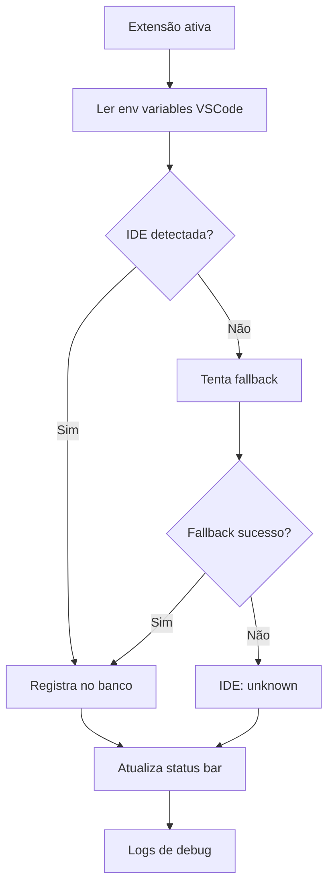

# 🔍 PRD - Registro de Nome da IDE

## Visão Geral
Capturar e registrar automaticamente qual IDE o usuário está usando (VS Code, Code - Insiders, Cursor, Windsurf, Google Antigravity) para melhor análise de produtividade e compatibilidade de ambiente. O foco é detectar a IDE atual sem impacto no desempenho.

## Problema
Hoje, o MyTimeTrace não consegue diferenciar qual IDE está rodando a extensão. Isso impede análise de produtividade por ambiente, detecção de conflitos e relatórios personalizados por IDE. Usuários que usam múltiplas IDEs não têm visibilidade clara de onde estão gastando tempo.

## Objetivos
- Detectar e registrar qual IDE está em uso automaticamente.
- Sincronizar info da IDE com dados de rastreamento de tempo.
- Permitir filtros e relatórios por IDE no dashboard.
- Suportar detecção de versão (ex: Code - Insiders vs Code estável).
- Manter registro histórico de mudanças de IDE.

## Não Objetivos
- Forçar uso de uma IDE específica.
- Bloquear extensão em determinadas IDEs.
- Análise de performance por IDE na fase inicial.
- Suporte a IDEs diferentes de VS Code e derivadas.

## Público-Alvo
- Desenvolvedores que usam múltiplas IDEs.
- Times que precisam auditar ambiente de desenvolvimento.
- Usuários interessados em análise detalhada de produtividade.

## Escopo Do MVP
### Funcionalidades
- Detectar nome da IDE na inicialização da extensão.
- Registrar no banco local qual IDE está em uso.
- Exibir IDE atual na status bar.
- Incluir IDE nos dados exportados.
- Sincronizar IDE com backend (se houver sincronização).
- Alerta se houve troca de IDE.

### IDEs Suportadas
- VS Code (stable)
- Code - Insiders
- Cursor
- Windsurf
- Google Antigravity

## Requisitos Funcionais
### RF01 - Detectar IDE na inicialização
A extensão deve identificar qual IDE está executando na primeira ativação.

### RF02 - Armazenar nome da IDE
Guardar nome da IDE no banco local com timestamp.

### RF03 - Rastrear mudanças de IDE
Se o usuário trocar de IDE, registrar nova entrada no histórico.

### RF04 - Exibir IDE no status bar
Mostrar ícone ou texto da IDE atual para o usuário saber qual está usando.

### RF05 - Incluir IDE nos dados
Quando exportar ou sincronizar dados, incluir qual IDE gerou cada registro.

### RF06 - Versão da IDE
Capturar versão (ex: 1.95.2 para VS Code, insiders para Code - Insiders).

## Requisitos Não Funcionais
- Detecção deve ser imediata, sem delay.
- Impacto zero no desempenho.
- Lógica deve ser independente de plataforma (Windows, macOS, Linux).
- Detecção deve funcionar mesmo com extensão desabilitada e reabilitada.
- Log claro para debug de detecção falhada.

## UX / UI
### Entradas Do Usuário
- Nenhuma entrada obrigatória. Detecção é automática.
- Opção futura: permitir override manual da IDE detectada (settings).

### Saídas Na UI
- Status bar: exibir emoji + nome da IDE (ex: 🚀 Cursor v0.45.2).
- Dashboard: filtro por IDE em painel dedicado.
- Tooltip ao passar mouse: versão completa da IDE.
- Logs: registrar qual IDE foi detectada ao iniciar.

## Regras De Produto
- Detectar IDE uma vez por sessão, na inicialização.
- Se IDE mudar entre sessões, registrar como novo evento.
- Versão da IDE deve ser atualizada a cada novo start.
- Informação de IDE é imutável após registro (apenas timestamps).
- Sempre registrar timestamp da detecção para auditoria.

## Fluxo Esperado


## Estratégia De Detecção

### Método 1 - Environment Variables (Preferido)
- `VSCODE_PID` - Sempre presente em VS Code
- `VSCODE_VERSION` - Versão do VS Code
- `VSCODE_RELEASE` - insiders ou stable
- `VSCODE_CLI` - Presente se aberto via CLI

### Método 2 - Process Info
- Ler nome do processo pai: `code`, `cursor`, `windsurf`
- Ler path do executável para extrair nome

### Método 3 - Package.json / Extension Context
- Verificar context.extensionPath
- Analisar pasta de instalação

### Método 4 - User Agent Header
- Em sincronização: enviar IDE na requisição

## Premissas Técnicas
- VS Code fornece `process.env.VSCODE_VERSION` confiável.
- Detecção por process name funciona em todas plataformas.
- **Tabela `time_entries` já existe** e aceita novo campo sem impacto.
- Migração apenas adiciona coluna sem default (NULL para dados antigos).
- Dados históricos não perdem integridade (NULL indica desconhecido).
- Sincronização já prepara headers customizados.

## Dependências Prováveis
- Módulo `deviceInfo.ts` (expandir com detecção de IDE).
- Módulo `database.ts` (migração: adicionar coluna em time_entries).
- Módulo `statusBar.ts` (exibir IDE atual).
- Módulo `syncManager.ts` (enviar IDE ao backend).
- Módulo `stats.ts` (filtrar por IDE nos relatórios).

## Estrutura De Dados

### Migração Da Tabela Existente
A tabela `time_entries` **já existe** no banco de dados com dados históricos. Será adicionada apenas uma coluna nova:

```sql
-- Adicionar coluna à tabela existente
ALTER TABLE time_entries ADD COLUMN ide_name TEXT;
```

**Observações:**
- ✅ Tabela `time_entries` já está em produção
- ✅ Dados existentes serão preenchidos com NULL (desconhecido)
- ✅ Novos registros receberão IDE detectada automaticamente
- ⚠️ Dados antigos anteriores a essa migração terão ide_name = NULL

### Tabela: `ide_sessions` (Opcional - Fase 2)
Para manter histórico detalhado de sessões (implementar na Fase 2):

```sql
CREATE TABLE ide_sessions (
  id INTEGER PRIMARY KEY AUTOINCREMENT,
  ide_name TEXT NOT NULL,        -- 'VS Code', 'Cursor', etc
  ide_version TEXT,               -- '1.95.2', '0.45.1'
  ide_release TEXT,               -- 'stable' ou 'insiders'
  detected_at DATETIME DEFAULT CURRENT_TIMESTAMP,
  session_id TEXT UNIQUE,          -- ID da sessão para rastreio
  platform TEXT,                   -- 'win32', 'darwin', 'linux'
  extension_version TEXT
);
```

### Schema Atualizado De `time_entries`
```
Colunas existentes:
  - id
  - file_name
  - project_name
  - time_spent
  - timestamp
  ... (outras colunas)

Coluna nova:
  + ide_name TEXT DEFAULT 'VS Code'  -- Nome da IDE que gerou o registro
```

## Métricas De Sucesso
- 100% das sessões com IDE detectada corretamente.
- Tempo de detecção < 100ms.
- % de coincidência entre IDE reportada vs IDE real.
- Nº de usuários usando múltiplas IDEs (estatística).
- Cobertura de IDEs: % com suporte implementado.

## Critérios De Aceite
- ✅ VS Code estável detectado como "VS Code".
- ✅ Code - Insiders detectado e diferenciado.
- ✅ Cursor detectado e registrado.
- ✅ Windsurf detectado se instalado.
- ✅ Google Antigravity detectado se instalado.
- ✅ Versão exata da IDE capturada.
- ✅ IDE exibida no status bar.
- ✅ Teste detecta corretamente em ambiente simulado.
- ✅ Histórico de troca de IDE registrado.
- ✅ Sem impacto de performance.

## Fases Sugeridas

### Fase 1: MVP - Detecção Básica (1-2 dias)
- Detectar 5 IDEs: VS Code, Code - Insiders, Cursor, Windsurf, Google Antigravity.
- **Migração:** Adicionar coluna `ide_name` em `time_entries` (sem default).
- Dados antigos ficam como NULL (desconhecido).
- Exibir IDE atual no status bar.
- Testes básicos de detecção em ambiente real.

### Fase 2: Histórico e Análise (2-3 dias)
- Tabela dedicada `ide_sessions`.
- Rastrear troca de IDE entre sessões.
- Filtro por IDE no dashboard.
- Relatório de uso por IDE.

### Fase 3: Sincronização (1-2 dias)
- Enviar IDE ao backend.
- Correlacionar commits com IDE usada.
- Alertas se IDE não suportada.

### Fase 4: Configuração Avançada (1 dia)
- Settings para override manual.
- Detecção de IDE remota (SSH).
- Suporte a fork de VS Code customizados.

## Perguntas Em Aberto
- Usar versão sem build metadata (ex: 1.95.2 vs 1.95.2-dev)?
- Registrar IDE mesmo se extensão falhada na detecção?
- Sincronizar histórico completo ou só IDE atual?
- Alertar se IDE mudar durante a mesma sessão?
- Suporte a IDEs não-VS Code (Vim, Emacs, JetBrains)?

## Riscos
- IDE pode não expor env variables confiáveis.
- Fork de VS Code customizados difíceis de detectar.
- Nome da IDE pode variar entre versões.
- Detecção pode falhar em ambientes containerizados.
- Dados legados sem IDE causam inconsistência.

## Exemplos De Output

### Status Bar
```
🚀 Cursor (v0.45.2) | ⏱️ 2h 34m
VS Code Insiders (v1.95.2-insiders) | ⏱️ 45m
```

### Dashboard
```
Filter by IDE:
[ ] VS Code (2345 entries)
[ ] Code - Insiders (156 entries)
[ ] Cursor (567 entries)
[ ] Windsurf (89 entries)
```

### Sync Payload
```json
{
  "time_entry": {
    "ide_name": "Cursor",
    "ide_version": "0.45.2",
    "ide_release": "stable",
    ...
  }
}
```

## Checklist De Implementação
- [ ] Expandir `deviceInfo.ts` com funções de detecção de IDE
- [ ] Criar teste em `deviceManager.test.ts` para validar detecção
- [ ] **Criar migração SQL:** Adicionar coluna `ide_name` (NULL) a `time_entries`
- [ ] Implementar armazenamento no `database.ts`
- [ ] Atualizar `statusBar.ts` para exibir IDE detectada
- [ ] Integrar com `stats.ts` para filtros por IDE
- [ ] Atualizar `syncManager.ts` para enviar IDE ao backend
- [ ] Testar migração em ambiente com dados existentes
- [ ] Testar detecção em múltiplas IDEs
- [ ] Validar backward compatibility com dados antigos (NULL)
- [ ] Atualizar documentação em docs/
